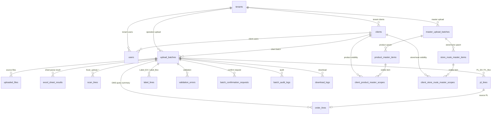
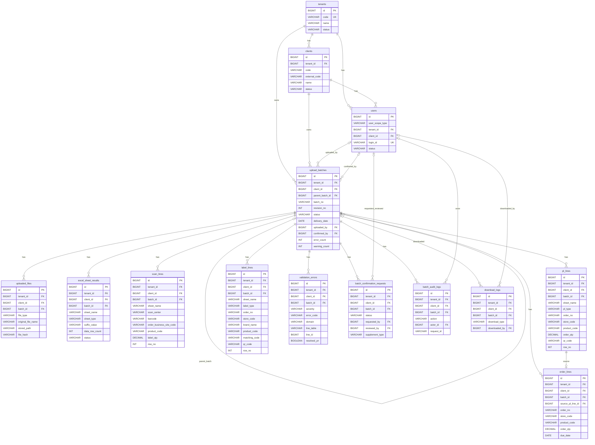
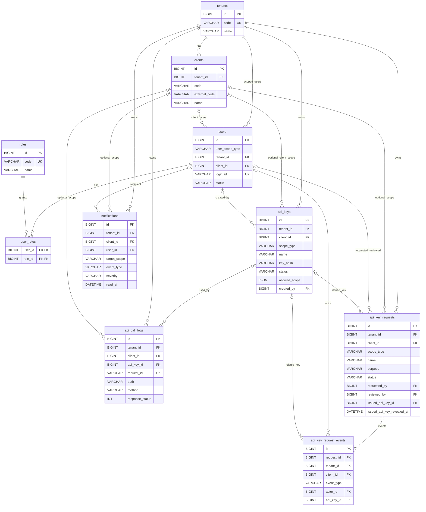
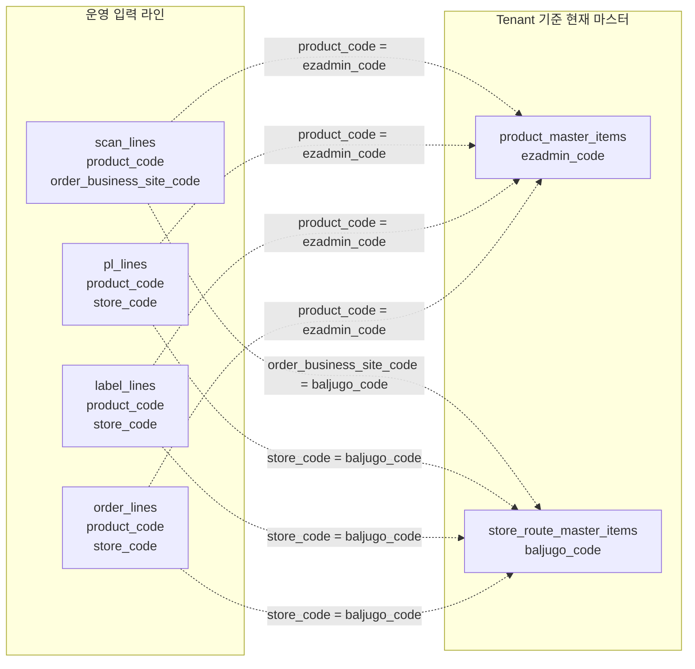

# OMS 현재 프로젝트 ERD

작성 기준: `backend/src/main/resources/db/migration`의 실제 migration `V1~V17`

이 문서는 발표 화면에서 잘 보이도록 전체 ERD를 한 번에 크게 펼치기보다, 업무 흐름별로 나눈 ERD를 제공한다. 컬럼은 모든 컬럼을 나열하지 않고, 관계 파악에 필요한 PK/FK와 핵심 업무 컬럼만 표시한다.

## 1. 발표용 한 장 요약

OMS의 현재 DB 구조는 `tenant -> client -> upload_batch`를 중심으로 운영 데이터가 쌓이고, 마스터 데이터는 tenant 기준으로 관리한 뒤 client별 공개 범위를 별도로 제어하는 구조다.

## 2. 운영 업로드 중심 ERD

운영 데이터의 중심은 `upload_batches`다. 엑셀 업로드 후 파일, 시트 파싱 결과, Scan/PL/Label 원천 라인, PL 기반 주문 조회용 요약 라인, 검증 오류, 확정 요청, 감사/다운로드 로그가 batch 기준으로 연결된다.

## 3. 마스터 데이터와 client 공개 범위 ERD

상품 마스터와 배송지/차량 마스터는 tenant 기준 현재 데이터를 upsert한다. client별로 어떤 마스터를 볼 수 있는지는 scope 테이블에서 관리한다.

```mermaid
erDiagram
  tenants {
    BIGINT id PK
    VARCHAR code UK
    VARCHAR name
  }

  clients {
    BIGINT id PK
    BIGINT tenant_id FK
    VARCHAR code
    VARCHAR name
  }

  users {
    BIGINT id PK
    BIGINT tenant_id FK
    BIGINT client_id FK
    VARCHAR login_id UK
  }

  master_upload_batches {
    BIGINT id PK
    BIGINT tenant_id FK
    VARCHAR master_type
    VARCHAR status
    VARCHAR original_file_name
    INT row_count
    INT inserted_count
    INT updated_count
    INT failed_count
    BIGINT uploaded_by FK
  }

  product_master_items {
    BIGINT id PK
    BIGINT tenant_id FK
    VARCHAR ezadmin_code UK
    VARCHAR product_name
    VARCHAR customer_product_code
    DECIMAL box_qty
    BOOLEAN active_yn
    BIGINT last_master_upload_batch_id FK
  }

  store_route_master_items {
    BIGINT id PK
    BIGINT tenant_id FK
    VARCHAR baljugo_code UK
    VARCHAR customer_code
    VARCHAR brand_name
    VARCHAR store_name
    VARCHAR delivery_day
    VARCHAR vehicle_name
    BOOLEAN active_yn
    BIGINT last_master_upload_batch_id FK
  }

  master_upload_row_errors {
    BIGINT id PK
    BIGINT tenant_id FK
    BIGINT master_upload_batch_id FK
    VARCHAR master_type
    INT row_no
    VARCHAR column_name
    VARCHAR error_code
  }

  client_master_visibility_settings {
    BIGINT id PK
    BIGINT tenant_id FK
    BIGINT client_id FK
    VARCHAR product_visibility_mode
    VARCHAR store_route_visibility_mode
    BIGINT updated_by FK
  }

  client_product_master_scopes {
    BIGINT id PK
    BIGINT tenant_id FK
    BIGINT client_id FK
    BIGINT product_master_item_id FK
    VARCHAR status
    VARCHAR source
    BIGINT created_by FK
  }

  client_store_route_master_scopes {
    BIGINT id PK
    BIGINT tenant_id FK
    BIGINT client_id FK
    BIGINT store_route_master_item_id FK
    VARCHAR status
    VARCHAR source
    BIGINT created_by FK
  }

  client_product_code_mappings {
    BIGINT id PK
    BIGINT tenant_id FK
    BIGINT client_id FK
    VARCHAR client_product_code
    VARCHAR ezadmin_code
    BOOLEAN active_yn
  }

  client_store_code_mappings {
    BIGINT id PK
    BIGINT tenant_id FK
    BIGINT client_id FK
    VARCHAR client_store_code
    VARCHAR baljugo_code
    BOOLEAN active_yn
  }

  client_aliases {
    BIGINT id PK
    BIGINT tenant_id FK
    BIGINT client_id FK
    VARCHAR alias_name
    VARCHAR normalized_alias UK
    BOOLEAN active_yn
  }

  master_data_add_requests {
    BIGINT id PK
    BIGINT tenant_id FK
    BIGINT client_id FK
    VARCHAR request_type
    VARCHAR status
    JSON request_payload_json
    BIGINT requested_by FK
    BIGINT reviewed_by FK
  }

  tenants ||--o{ clients : has
  tenants ||--o{ master_upload_batches : has
  users |o--o{ master_upload_batches : uploaded_by
  master_upload_batches ||--o{ product_master_items : last_upload
  master_upload_batches ||--o{ store_route_master_items : last_upload
  master_upload_batches ||--o{ master_upload_row_errors : row_errors

  tenants ||--o{ product_master_items : owns
  tenants ||--o{ store_route_master_items : owns
  clients ||--o{ client_master_visibility_settings : settings
  users |o--o{ client_master_visibility_settings : updated_by

  clients ||--o{ client_product_master_scopes : product_scope
  product_master_items ||--o{ client_product_master_scopes : scoped_item
  users |o--o{ client_product_master_scopes : created_by

  clients ||--o{ client_store_route_master_scopes : store_route_scope
  store_route_master_items ||--o{ client_store_route_master_scopes : scoped_item
  users |o--o{ client_store_route_master_scopes : created_by

  clients ||--o{ client_product_code_mappings : product_code_mapping
  clients ||--o{ client_store_code_mappings : store_code_mapping
  clients ||--o{ client_aliases : aliases
  clients ||--o{ master_data_add_requests : add_request
  users |o--o{ master_data_add_requests : requested_reviewed
```

## 4. 인증, API Key, 알림 ERD

내부 사용자는 `users`, `roles`, `user_roles`로 관리한다. 외부 연동은 `api_keys`와 API 호출 로그, API Key 발급 요청/이벤트로 구성된다.

## 5. 코드 기반 매칭 관계

아래 관계는 현재 DB foreign key가 아니다. 운영 데이터 검증/조회에서 문자열 코드로 매칭하는 업무 관계다.

## 6. 발표 시 강조 포인트

- `upload_batches`가 운영 데이터의 중심이다.
- `scan_lines`, `pl_lines`, `label_lines`, `order_lines`는 모두 `batch_id`, `tenant_id`, `client_id`를 가진다.
- `order_lines`는 원본 주문 테이블이 아니라 `pl_lines`를 기반으로 재구성한 OMS 조회용 요약 데이터다.
- `Scan_upload_*`는 정식 입력 시트이며, suffix는 `scan_center`로 저장된다.
- 상품/배송지 마스터는 tenant 기준 현재 데이터이고, client 공개 범위는 scope 테이블로 제어한다.
- 상품/배송지 매칭은 DB FK가 아니라 코드값 매칭이다.
- API Key는 client 범위와 tenant 범위를 모두 지원하도록 `scope_type`과 nullable `client_id` 구조를 가진다.

