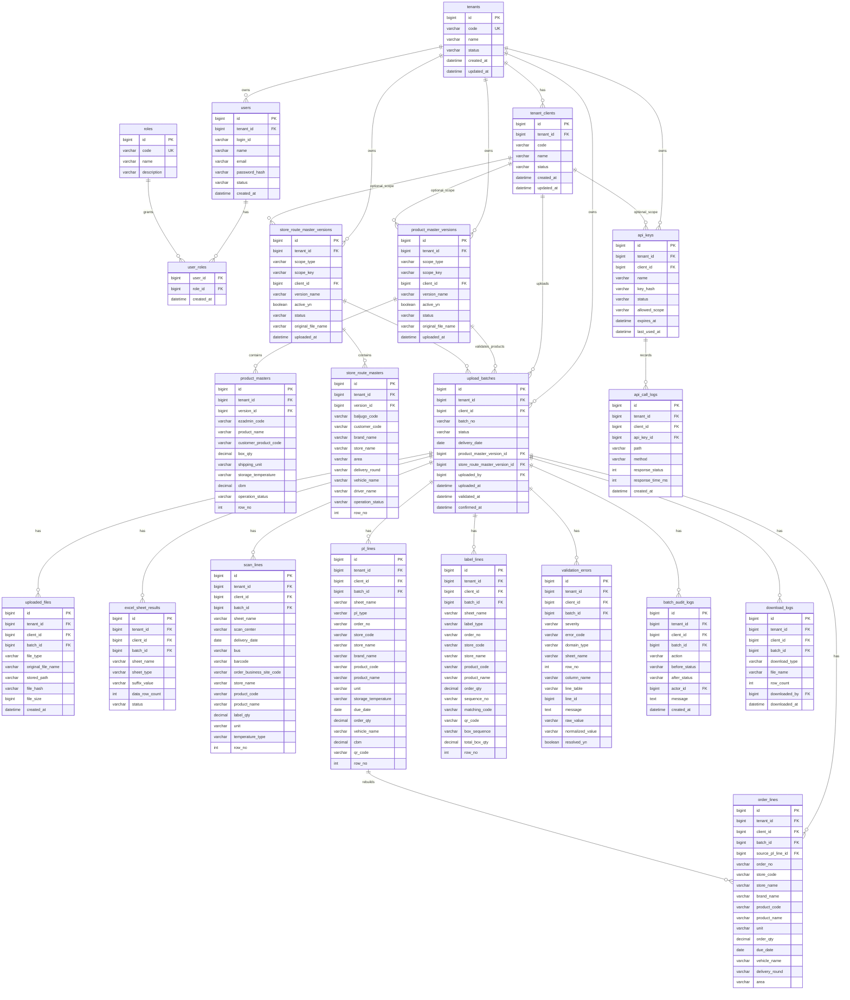

# OMS ERD 설계 초안

이 문서는 현재까지 합의한 OMS DB 구조를 ERD 관점에서 정리한 설계 초안이다. 최종 요구사항 문서와 `DB_DESIGN_PROPOSAL.md`를 함께 기준으로 삼는다.

## 1. 설계 결론

OMS의 데이터 스코프는 다음 구조를 기본으로 한다.

```text
tenant = 물류사
client = 물류사의 고객사 / 화주사
batch = 특정 고객사의 OIS 엑셀 업로드 단위
master = 기본적으로 물류사가 관리하는 tenant 기준 마스터
```

즉 주문/업로드 데이터는 `tenant_id + client_id` 기준이고, 상품 마스터와 배송지/차량 마스터는 기본적으로 `tenant_id` 기준이다.

다만 고객사별 코드 체계나 예외 마스터가 필요해질 수 있으므로 마스터 버전에는 `scope_type`, `scope_key`, `client_id`를 둔다. MySQL의 nullable unique 제약 차이를 피하기 위해 unique 기준에는 nullable `client_id` 대신 `scope_key`를 사용한다.

```text
scope_type = TENANT, scope_key = TENANT       -> 물류사 공통 마스터
scope_type = CLIENT, scope_key = client id    -> 특정 고객사 전용 예외 마스터
```

1차 MVP에서는 `scope_type = TENANT`를 기본으로 사용한다.

## 2. 주요 원칙

- `tenants`는 이 시스템을 사용하는 물류사를 의미한다.
- `tenant_clients`는 물류사의 고객사 또는 화주사를 의미한다.
- 주문/업로드 배치는 `tenant_id + client_id`를 가진다.
- `scan_lines`, `pl_lines`, `label_lines`, `order_lines`는 모두 `tenant_id`, `client_id`, `batch_id`를 가진다.
- 상품 마스터와 배송지/차량 마스터는 기본적으로 물류사 기준으로 관리한다.
- 고객사별 마스터 예외가 필요하면 `scope_type = CLIENT` 또는 별도 매핑 테이블로 확장한다.
- 요구사항 기준 1차 MVP는 고객사 코드 매핑 없이 운영 데이터와 물류사 마스터를 직접 매칭한다.
- `upload_batches`는 운영 데이터의 중심이다.
- 배치마다 검증에 사용한 상품 마스터 버전과 배송지/차량 마스터 버전을 기록한다.
- 상품 마스터와 배송지/차량 마스터는 서로 직접 조인하지 않는다.
- 운영 데이터의 `product_code`는 상품 마스터의 `ezadmin_code`와 매칭한다.
- 운영 데이터의 `store_code` 또는 `order_business_site_code`는 배송지/차량 마스터의 `baljugo_code`와 매칭한다.
- 주문번호, 거래처코드, 품목코드, 바코드, QR코드는 문자열로 보존한다.
- 차수별 주문 조회와 차수별 다운로드는 추후 구현이다. 단, `vehicle_name`, `delivery_round`, `area` 등 관련 값은 보존한다.

## 3. ERD



## 4. 테이블 역할 요약

| 테이블 | 역할 |
|---|---|
| `tenants` | OMS를 사용하는 물류사 |
| `tenant_clients` | 물류사의 고객사/화주사 |
| `users`, `roles`, `user_roles` | 사용자와 권한 |
| `api_keys` | 외부 WOS/PL API 인증 키 |
| `upload_batches` | 고객사별 OIS 엑셀 업로드 배치 |
| `uploaded_files` | 업로드 원본 파일 메타정보 |
| `product_master_versions`, `product_masters` | 물류사 기준 상품 마스터 버전과 상세 |
| `store_route_master_versions`, `store_route_masters` | 물류사 기준 배송지/차량 마스터 버전과 상세 |
| `excel_sheet_results` | 시트별 파싱 결과와 행 수 |
| `scan_lines` | `Scan_upload_*` 행 데이터 |
| `pl_lines` | `PL_EA`, `PL_Box` 행 데이터 |
| `label_lines` | `Label_EA`, `Label_Box` 행 데이터 |
| `order_lines` | PL 기반 OMS 주문 조회용 요약 데이터 |
| `validation_errors` | 검증 오류, 경고, 정보 |
| `batch_audit_logs` | 배치 상태 전환 및 작업 이력 |
| `api_call_logs` | 외부 API 호출 이력 |
| `download_logs` | 다운로드 이력 |

## 5. 주요 관계 설명

### 5-1. Tenant / Client

```text
tenants 1:N tenant_clients
```

한 물류사는 여러 고객사/화주사의 주문을 처리할 수 있다.

### 5-2. Batch

```text
tenant_clients 1:N upload_batches
upload_batches 1:N scan_lines
upload_batches 1:N pl_lines
upload_batches 1:N label_lines
upload_batches 1:N order_lines
```

배치는 특정 물류사의 특정 고객사가 제공한 하나의 OIS 엑셀 업로드 단위다.

### 5-3. Master

```text
tenants 1:N product_master_versions
product_master_versions 1:N product_masters

tenants 1:N store_route_master_versions
store_route_master_versions 1:N store_route_masters
```

마스터는 기본적으로 물류사가 관리한다. 고객사별 예외가 있으면 `scope_type = CLIENT`, `client_id = 해당 고객사`로 확장한다.

### 5-4. Validation

```text
upload_batches N:1 product_master_versions
upload_batches N:1 store_route_master_versions
upload_batches 1:N validation_errors
```

배치는 검증에 사용한 상품 마스터 버전과 배송지/차량 마스터 버전을 저장한다. Error 등급 검증 오류가 존재하면 배치를 확정할 수 없다.

### 5-5. Order Lines

```text
pl_lines 1:1 또는 1:N order_lines
```

`order_lines`는 원본 주문이 아니다. `PL_EA`, `PL_Box` 데이터를 기준으로 재구성한 OMS 조회용 주문 요약 데이터다.

## 6. 주요 Unique 제약

| 테이블 | Unique 제약 |
|---|---|
| `tenants` | `code` |
| `tenant_clients` | `tenant_id`, `code` |
| `users` | `tenant_id`, `login_id` |
| `roles` | `code` |
| `api_keys` | `tenant_id`, `key_hash` |
| `upload_batches` | `tenant_id`, `client_id`, `batch_no` |
| `product_master_versions` | `tenant_id`, `scope_type`, `scope_key`, `version_name` |
| `product_masters` | `tenant_id`, `version_id`, `ezadmin_code` |
| `store_route_master_versions` | `tenant_id`, `scope_type`, `scope_key`, `version_name` |
| `store_route_masters` | `tenant_id`, `version_id`, `baljugo_code` |
| `excel_sheet_results` | `tenant_id`, `client_id`, `batch_id`, `sheet_name` |
| `scan_lines` | 권장: `tenant_id`, `client_id`, `batch_id`, `barcode` |
| `order_lines` | 권장: `source_pl_line_id` |

주문번호는 전역 unique로 보지 않는다. 고객사마다 주문번호 체계가 다를 수 있으므로 `tenant_id + client_id + batch_id` 범위에서 검증 정책을 정한다.

## 7. 주요 Index 제안

| 테이블 | Index |
|---|---|
| `upload_batches` | `tenant_id, client_id, status`, `tenant_id, client_id, delivery_date`, `tenant_id, client_id, confirmed_at` |
| `product_masters` | `tenant_id, version_id, ezadmin_code`, `tenant_id, version_id, product_name` |
| `store_route_masters` | `tenant_id, version_id, baljugo_code`, `tenant_id, version_id, vehicle_name`, `tenant_id, version_id, area` |
| `scan_lines` | `tenant_id, client_id, batch_id`, `tenant_id, client_id, delivery_date`, `tenant_id, client_id, product_code`, `tenant_id, client_id, order_business_site_code`, `tenant_id, client_id, barcode` |
| `pl_lines` | `tenant_id, client_id, batch_id`, `tenant_id, client_id, due_date`, `tenant_id, client_id, order_no`, `tenant_id, client_id, store_code`, `tenant_id, client_id, product_code` |
| `label_lines` | `tenant_id, client_id, batch_id`, `tenant_id, client_id, order_no`, `tenant_id, client_id, store_code`, `tenant_id, client_id, product_code`, `tenant_id, client_id, matching_code` |
| `order_lines` | `tenant_id, client_id, batch_id`, `tenant_id, client_id, due_date`, `tenant_id, client_id, order_no`, `tenant_id, client_id, store_code`, `tenant_id, client_id, product_code` |
| `validation_errors` | `tenant_id, client_id, batch_id, severity`, `tenant_id, client_id, batch_id, error_code`, `tenant_id, client_id, batch_id, sheet_name, row_no` |
| `download_logs` | `tenant_id, client_id, batch_id`, `tenant_id, client_id, download_type`, `tenant_id, client_id, downloaded_at` |
| `api_call_logs` | `tenant_id, client_id, api_key_id`, `tenant_id, client_id, path`, `tenant_id, client_id, created_at` |

차수별 조회용 복합 인덱스는 업무 개념 확정 후 추가한다.

## 8. 1차 MVP와 추후 확장 구분

### 1차 MVP

- 물류사 `tenants`
- 고객사/화주사 `tenant_clients`
- 물류사 기준 상품 마스터
- 물류사 기준 배송지/차량 마스터
- 고객사별 OIS 엑셀 업로드 배치
- Scan/PL/Label 저장
- PL 기반 `order_lines` 생성
- 마스터 매칭 검증
- WOS Scan API
- PL API
- 라벨 다운로드
- 감사/다운로드/API 호출 로그

### 추후 확장

- 고객사별 전용 마스터 `scope_type = CLIENT`
- 고객사별 상품코드 매핑
- 고객사별 배송지코드 매핑
- 고객사별 엑셀 템플릿 관리
- 차수별 주문 조회
- 차수별 다운로드
- 차수별 대시보드

## 9. 추후 고려할 매핑 테이블

현재 요구사항에서는 입력 데이터의 `품목코드`가 상품 마스터의 `ezadmin_code`와 직접 매칭되고, `거래처코드` 또는 `주문사업장코드`가 배송지/차량 마스터의 `baljugo_code`와 직접 매칭된다. 따라서 아래 매핑 테이블은 1차 MVP 필수가 아니다.

고객사별 코드 체계가 다르면 다음 테이블을 추가한다.

```text
client_product_code_mappings
- id
- tenant_id
- client_id
- client_product_code
- tenant_product_code
- product_master_id
- status

client_store_code_mappings
- id
- tenant_id
- client_id
- client_store_code
- baljugo_code
- store_route_master_id
- status
```

이 매핑 테이블은 1차 MVP 필수는 아니며, 고객사별 코드 체계 차이가 확인될 때 추가한다.
