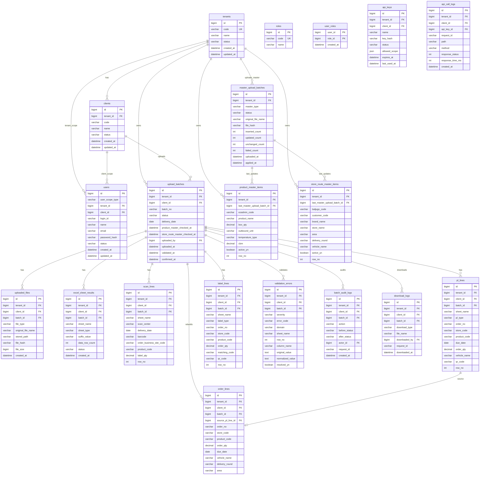
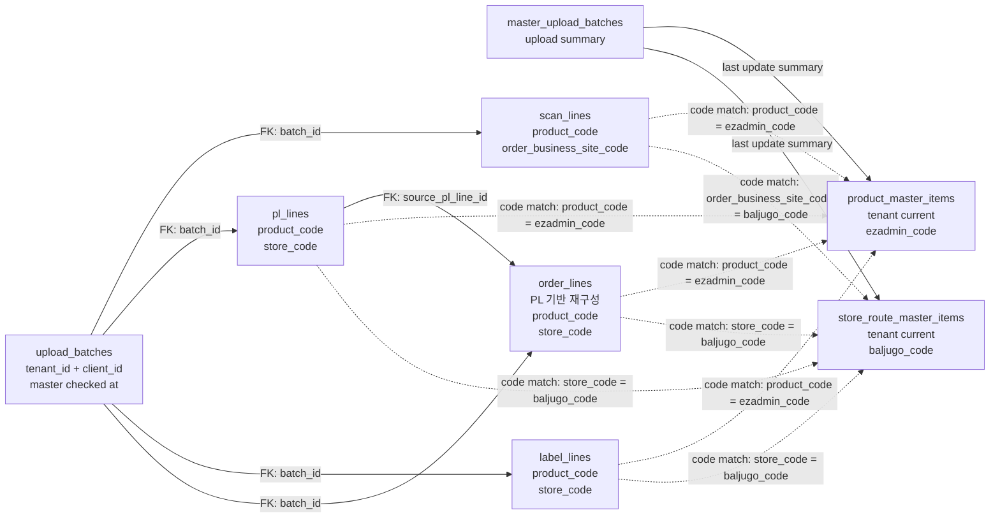

# OMS ERD 설계 초안

이 문서는 OMS Phase 1 데이터 모델을 ERD 관점에서 정리한 리뷰용 문서다. 최상위 기준은 `AGENTS.md`와 최종 요구사항 문서이며, 상세 컬럼/인덱스는 `DB_DESIGN_PROPOSAL.md`를 따른다.

## 1. 설계 결론

```text
tenant = OMS를 사용하는 물류사
client = 물류사의 고객사 또는 화주사
batch = 특정 tenant/client의 OIS 엑셀 업로드 단위
master = 1차 MVP에서는 tenant 기준 상품 마스터와 배송지/차량 마스터
```

- 업로드/운영 데이터는 `tenant_id + client_id` 기준으로 격리한다.
- 로그인 사용자는 `SYSTEM`, `TENANT`, `CLIENT` 스코프로 구분한다. 1차 MVP 기본 사용자는 물류사 소속 `TENANT` 사용자다.
- `upload_batches`가 운영 데이터의 중심이다.
- `scan_lines`, `pl_lines`, `label_lines`, `order_lines`는 모두 `tenant_id`, `client_id`, `batch_id`를 가진다.
- 상품 마스터와 배송지/차량 마스터는 서로 직접 조인하지 않는다.
- 운영 데이터가 중심이 되고, 운영 데이터의 코드가 두 마스터에 각각 직접 매칭된다.
- 마스터는 업로드마다 전체 버전을 만들지 않고 tenant별 현재 데이터를 upsert한다.
- `order_lines`는 원본 주문이 아니라 PL 기반 OMS 조회용 요약 데이터다.
- 차수별 조회/다운로드는 추후 구현이다. 단, `vehicle_name`, `delivery_round`, `area` 원천 값은 보존한다.

## 2. 테이블명 기준

테이블명은 snake_case 복수형으로 통일한다.

| 영역 | 테이블 |
|---|---|
| 기준정보 | `tenants`, `clients`, `users`, `roles`, `user_roles`, `api_keys` |
| 업로드 | `upload_batches`, `uploaded_files`, `excel_sheet_results` |
| 운영 데이터 | `scan_lines`, `pl_lines`, `label_lines`, `order_lines` |
| 마스터 | `master_upload_batches`, `product_master_items`, `store_route_master_items` |
| 검증/로그 | `validation_errors`, `batch_audit_logs`, `api_call_logs`, `download_logs` |

## 3. Mermaid ERD

아래 ERD는 물리 FK 중심 관계다. 운영 데이터와 마스터 상세 행의 `product_code`, `store_code`, `order_business_site_code` 매칭은 FK가 아니라 검증/조회 시점의 논리 매칭이므로 별도 관계도로 분리한다.



## 4. 논리 매칭 관계도

아래 관계는 발표자료에서 끊겨 보이기 쉬운 부분이다. 선이 없는 것이 아니라, 원본 엑셀 값을 먼저 저장한 뒤 검증 시점의 tenant별 현재 마스터와 코드로 매칭하는 구조다.



## 5. 마스터 매칭 관계

마스터 간 직접 조인은 금지한다. 아래 관계는 FK가 아니라 검증/조회 시 적용하는 매칭 규칙이다.

```text
scan_lines.product_code                 -> product_master_items.ezadmin_code
pl_lines.product_code                   -> product_master_items.ezadmin_code
label_lines.product_code                -> product_master_items.ezadmin_code
order_lines.product_code                -> product_master_items.ezadmin_code

scan_lines.order_business_site_code     -> store_route_master_items.baljugo_code
pl_lines.store_code                     -> store_route_master_items.baljugo_code
label_lines.store_code                  -> store_route_master_items.baljugo_code
order_lines.store_code                  -> store_route_master_items.baljugo_code
```

매칭은 검증 시점의 tenant별 현재 마스터 기준으로 수행한다. 검증 기준 시각은 `upload_batches.product_master_checked_at`, `upload_batches.store_route_master_checked_at`에 기록한다.

## 6. 주요 관계 설명

### Tenant / Client

```text
tenants 1:N clients
```

한 물류사는 여러 고객사/화주사의 업로드 데이터를 처리할 수 있다.

### Users

```text
SYSTEM user: tenant_id NULL, client_id NULL
TENANT user: tenant_id NOT NULL, client_id NULL
CLIENT user: tenant_id NOT NULL, client_id NOT NULL
```

1차 MVP의 기본 운영 사용자는 `TENANT` 사용자다. `SYSTEM` 사용자는 전체 tenant 관리와 운영 지원을 위해 스키마에서 허용한다. `CLIENT` 사용자 로그인과 다중 고객사 접근은 추후 구현으로 두며, 필요 시 `user_client_scopes` 테이블을 추가한다.

### Batch

```text
clients 1:N upload_batches
upload_batches 1:N scan_lines
upload_batches 1:N pl_lines
upload_batches 1:N label_lines
upload_batches 1:N order_lines
```

배치는 특정 물류사와 특정 고객사의 OIS 엑셀 업로드 단위다.

### Master

```text
tenants 1:N product_master_items
tenants 1:N store_route_master_items
tenants 1:N master_upload_batches
```

1차 MVP의 마스터는 tenant별 현재 데이터로 관리한다. 마스터 엑셀 업로드 시 `tenant_id + ezadmin_code`, `tenant_id + baljugo_code` 기준으로 추가/수정 upsert하고, 파일 단위 처리 요약은 `master_upload_batches`에 남긴다. 고객사별 예외가 확인되면 별도 매핑 테이블 또는 `client_id` 확장으로 분리한다.

### Order Lines

```text
pl_lines 1:0..1 order_lines
```

`order_lines`는 원본 주문이 아니라 `PL_EA`, `PL_Box`에서 재구성한 OMS 조회용 주문 요약 데이터다.
현재 물리 DB는 `order_lines.source_pl_line_id`에 unique 제약을 두므로 PL 원천 행 1건은 최대 1개의 주문 조회용 행으로 재구성된다.

### Logs

```text
upload_batches 1:N batch_audit_logs
upload_batches 1:N download_logs
api_keys 1:N api_call_logs
```

배치 확정, 취소, 롤백, 다운로드, 외부 API 호출은 추적 가능해야 한다.

## 7. 주요 Unique 제약

| 테이블 | Unique 제약 |
|---|---|
| `tenants` | `code` |
| `clients` | `tenant_id`, `code` |
| `users` | `login_id` |
| `roles` | `code` |
| `api_keys` | `tenant_id`, `key_hash` |
| `upload_batches` | `tenant_id`, `client_id`, `batch_no` |
| `excel_sheet_results` | `batch_id`, `sheet_name` |
| `master_upload_batches` | 후보: `tenant_id`, `master_type`, `file_hash` |
| `product_master_items` | `tenant_id`, `ezadmin_code` |
| `store_route_master_items` | `tenant_id`, `baljugo_code` |
| `scan_lines` | 후보: `batch_id`, `barcode` |
| `order_lines` | 후보: `source_pl_line_id` |

주문번호는 전역 unique로 보지 않는다. 고객사별 체계가 다를 수 있으므로 `tenant_id + client_id + batch_id` 범위의 검증 정책으로 다룬다.

## 8. 차수별 조회 위치

차수별 주문 조회와 차수별 다운로드는 1차 MVP 필수 구현이 아니다.

- 저장: `pl_lines.vehicle_name`, `order_lines.vehicle_name`, `order_lines.delivery_round`, `order_lines.area`
- 추후 조회: 업무 정의 확정 후 복합 인덱스와 API를 추가한다.
- 현재 문서에서는 차수별 전용 테이블을 만들지 않는다.
