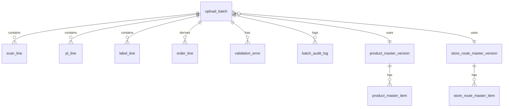

# OMS 개발팀 전달용 최종 요구사항 문서

- 문서명: OMS 개발팀 전달용 최종 요구사항 문서
- 작성일: 2026-05-28
- 용도: Codex 기반 개발 작업 지시 및 개발팀/기획팀/물류 운영팀 공통 기준 문서
- 개발 스택:
  - Frontend: React + TypeScript + Tailwind CSS
  - Backend: Spring Boot + Kotlin
- 최종 반영 사항:
  - 현재 업로드된 `웰스토리_발주정리매크로_수도권_251215(5).xlsm`을 1차 기준 입력 엑셀로 본다.
  - 과거 입력 엑셀 또는 과거자료는 이번 개발의 입력 기준으로 사용하지 않는다.
  - `Scan_upload`는 누락된 데이터가 아니라, 현재 입력 엑셀에 포함된 정식 입력 데이터로 본다.
  - 실제 시트명은 `Scan_upload_장지`, `Scan_upload_군량리`처럼 suffix가 붙는 구조이므로, 시스템은 `Scan_upload_*` 패턴을 Scan 업로드 계열 시트로 인식해야 한다.
  - 주문 원본 시트는 현재 입력 엑셀에 별도로 존재하지 않는다. 주문성 데이터는 OIS가 생성한 `Scan_upload_*`, `PL_EA`, `PL_Box`, `Label_EA`, `Label_Box` 시트 안에 포함되어 있다.
  - OMS는 원본 주문을 새로 생성하는 시스템이 아니라, OIS가 가공한 Scan/PL/Label 데이터를 저장·검증·조회·API 제공·다운로드하는 시스템이다.
  - 상품 마스터와 배송지/차량 마스터는 서로 직접 조인하지 않는다. 업로드된 Scan/PL/Label/주문 조회용 데이터가 중심이 되고, 이 데이터에 두 마스터를 각각 매칭한다.

---

## 0. 문서 표기 기준

### 0-1. 우선순위

| 표기 | 의미 |
|---|---|
| P0 / [필수] | 1차 MVP에서 반드시 구현해야 하는 기능 |
| P1 / [중요] | 실제 운영 안정성을 위해 우선 구현이 필요한 기능 |
| P2 / [추가] | 현재 요구사항에는 약하지만 운영 효율을 높이는 기능 |
| P3 / [향후] | 1차 이후 고도화 기능 |

### 0-2. 근거 표기

| 표기 | 의미 |
|---|---|
| 자료 기반 | 첨부 요구사항 또는 현재 입력 엑셀에서 직접 확인된 내용 |
| 확정 반영 | 대화 과정에서 사용자가 명확히 정정한 내용 |
| 추정 | 파일 구조와 물류 운영 맥락상 합리적으로 추정한 내용 |
| 제안 | 물류 OMS 제품화를 위한 설계 제안 |
| 확인 필요 | 개발 전 운영 담당자와 확정해야 하는 내용 |

---

# 1. 프로젝트 개요

## 1-1. 프로젝트 목적

| 항목 | 내용 | 근거 |
|---|---|---|
| 프로젝트명 | 물류사 OMS 업로드·조회·API·다운로드 시스템 | 제안 |
| 핵심 목적 | OIS가 생성한 Scan/PL/Label 목적별 엑셀 데이터를 OMS에 업로드하고, OMS가 이를 DB에 저장·검증·조회·API 제공·엑셀 다운로드하는 시스템 구축 | 자료 기반 |
| 입력 방식 | 1차는 엑셀 업로드 방식 | 자료 기반 |
| 구현 대상 | OMS | 자료 기반 |
| 구현 제외 | OIS, WMS, WOS, PL 시스템, 라벨 시스템 자체 | 자료 기반 |
| 외부 제공 | WOS는 Scan 데이터 API, PL은 Picking List API, 라벨은 엑셀 다운로드 | 자료 기반 |
| 주요 사용자 | 물류 운영자, OMS 관리자, 조회 사용자, API 사용자, 물류사 tenant 관리자 | 제안 |
| 개발 기준 스택 | React + TypeScript + Tailwind CSS / Spring Boot + Kotlin | 확정 반영 |

## 1-2. 시스템 위치

```text
프랜차이즈 / 고객사
- 원 주문 또는 발주 정보 생성

        ↓

OIS
- 구현 대상 아님
- 원 주문 데이터를 물류 처리용 엑셀로 가공
- Scan_upload_*, PL_EA, PL_Box, Label_EA, Label_Box 생성

        ↓

OMS
- 구현 대상
- OIS 생성 엑셀 업로드
- Scan/PL/Label 데이터 저장
- 주문성 데이터 조회용 View/요약 생성
- 상품 마스터 및 배송지/차량 마스터 매칭 검증
- 차수별 조회 및 다운로드
- WOS/PL API 제공
- 라벨 엑셀 다운로드 제공
- 작업 이력/오류/권한 관리

        ↓

WOS / PL / 라벨 / WMS 등 외부 시스템
- OMS가 제공하는 API 또는 다운로드 파일을 사용
```

## 1-3. 이번 개발에서 반드시 지켜야 할 전제

| 번호 | 전제 | 구현 영향 |
|---:|---|---|
| 1 | 현재 입력 파일은 OIS가 주문 데이터를 이미 가공해서 만든 엑셀이다. | OMS는 원본 주문 생성 로직을 담당하지 않는다. |
| 2 | 원본 주문 시트는 현재 입력 엑셀에 별도 존재하지 않는다. | 주문 조회는 PL 중심으로 재구성한 `order_line` 또는 `order_view`로 제공한다. |
| 3 | `Scan_upload_*`는 정식 입력 시트다. | QR 기반 자동 생성 기능은 1차 요구사항에서 제외한다. |
| 4 | `Scan_upload_군량리`처럼 헤더만 있고 데이터가 0건인 시트는 정상이다. | 필수 시트는 존재해야 하나, 데이터 0건은 오류가 아니다. |
| 5 | 상품 마스터와 배송지/차량 마스터는 서로 직접 합치지 않는다. 1차 MVP에서 두 마스터는 물류사 tenant 기준으로 관리한다. | 업로드 데이터의 `품목코드`는 상품 마스터에, `거래처코드/주문사업장코드`는 배송지/차량 마스터에 각각 매칭한다. |
| 6 | 차수별 조회는 마스터 조회가 아니라 주문/PL/Label/Scan 데이터를 차수 기준으로 조회하는 기능이라는 초안은 유지하되, 현재 업무 개념이 명확하지 않으므로 1차 MVP 필수 구현에서 제외하고 추후 구현으로 둔다. | 차수/차량 정보는 배송지/차량 마스터와 입력 데이터의 차량명 값을 활용한다. |

---

# 2. 개발 스택 및 구현 원칙

## 2-1. Frontend

| 항목 | 기준 |
|---|---|
| Framework | React |
| Language | TypeScript |
| Styling | Tailwind CSS |
| 권장 빌드 도구 | Vite |
| 권장 라우팅 | React Router |
| 권장 서버 상태 관리 | TanStack Query 또는 동등한 fetch/cache 레이어 |
| 권장 폼 처리 | React Hook Form + Zod 또는 동등한 타입 검증 |
| 권장 테이블 | Headless table 또는 자체 Table 컴포넌트 |
| 파일 업로드 | Multipart form-data |
| 다운로드 | Blob 응답 처리 후 파일 저장 |

### Frontend 구현 원칙

- 모든 API 응답 타입은 TypeScript interface/type으로 정의한다.
- 페이지는 `pages`, 공통 UI는 `components`, API 호출은 `api`, 타입은 `types`로 분리한다.
- Tailwind CSS 기반으로 구현하되, 물류 운영자가 긴 표를 다루므로 테이블 가독성, 필터, 고정 헤더, 가로 스크롤을 고려한다.
- Error/Warning/Info 검증 결과는 색상과 라벨로 명확히 구분한다.
- 배치 상태는 화면 전반에서 동일한 Badge 컴포넌트를 사용한다.

## 2-2. Backend

| 항목 | 기준 |
|---|---|
| Framework | Spring Boot |
| Language | Kotlin |
| Build | Gradle Kotlin DSL 권장 |
| Excel Parsing | Apache POI 권장. XLSM은 매크로 실행 없이 시트/셀 값만 읽는다. |
| Persistence | Spring Data JPA 또는 MyBatis 중 택1. 1차 권장은 Spring Data JPA. |
| DB | 아직 확정하지 않는다. 회사 표준 MySQL을 1차 MVP 기본 후보로 검토하고, PostgreSQL은 향후 확장성 비교안으로 함께 검토한다. 로컬 개발은 MySQL Docker 또는 Testcontainers 사용 가능. |
| API Format | REST JSON |
| File Upload | MultipartFile |
| Auth | 1차 내부 서비스면 세션/JWT 중 택1. API 사용자는 API Key 방식 권장. |
| Audit | 배치/수정/다운로드/API 호출 로그 저장 |

### Backend 구현 원칙

- Kotlin Entity는 JPA 제약을 고려해 `open class` 또는 kotlin-jpa plugin을 사용한다.
- 업로드 파일 원본은 파일 저장소에 보관하고, DB에는 경로/해시/크기/업로드자 정보를 저장한다.
- 엑셀 파싱 시 문자열 코드가 숫자/과학적 표기법으로 변형되지 않도록 원본 셀 표시값을 최대한 보존한다.
- `Scan_upload_*` 시트명 suffix, 예: `장지`, `군량리`는 `scanCenter` 또는 `scanRoute`로 저장한다. 실제 화면 용어는 확인 필요.
- 확정되지 않은 배치는 외부 API 응답 대상에서 제외한다.
- 모든 다운로드/API 응답은 `batchId`, `deliveryDate`, `sheetType`, `createdAt` 등 추적 가능한 메타정보를 포함한다.

## 2-3. 권장 Repository 구조

```text
oms/
  backend/
    build.gradle.kts
    src/main/kotlin/com/company/oms/
      OmsApplication.kt
      common/
        config/
        error/
        response/
        security/
        util/
      auth/
      upload/
      excel/
      batch/
      master/
      order/
      scan/
      pl/
      label/
      validation/
      download/
      externalapi/
      audit/
    src/test/kotlin/com/company/oms/

  frontend/
    package.json
    vite.config.ts
    tailwind.config.ts
    src/
      app/
      api/
      components/
      pages/
      routes/
      types/
      hooks/
      utils/
      styles/
```

---

# 3. 데이터 개념 정의

## 3-1. 주문 데이터

| 항목 | 정의 |
|---|---|
| 주문 | 물류사 관점에서 “어느 거래처/배송지에 어떤 상품을 몇 개 보내야 하는가”를 나타내는 출고 요청성 데이터 |
| 현재 엑셀 기준 | 원본 주문 시트가 따로 있는 것이 아니라, 주문성 컬럼이 `Scan_upload_*`, `PL_EA`, `PL_Box`, `Label_EA`, `Label_Box`에 포함되어 있음 |
| OMS 처리 기준 | `PL_EA` + `PL_Box`를 기준으로 주문 조회용 `order_line` 또는 `order_view`를 재구성하는 것을 권장 |
| 주의 | `order_line`은 원본 주문 그 자체가 아니라, OIS가 만든 PL 데이터에서 재구성한 OMS 조회용 주문 요약 데이터다. |

## 3-2. Scan / PL / Label

| 구분 | 시트 | 역할 | OMS 사용처 |
|---|---|---|---|
| Scan | `Scan_upload_장지`, `Scan_upload_군량리` | WOS/스캔 업로드용 바코드 단위 데이터 | WOS API, Scan 조회 |
| PL | `PL_EA`, `PL_Box` | 피킹 리스트 데이터 | PL API, 주문 조회, 차수별 조회 |
| Label | `Label_EA`, `Label_Box` | 라벨 출력용 데이터 | 라벨 엑셀 다운로드, 라벨 조회 |

## 3-3. 마스터 데이터

| 마스터 | 출처 | 기준 키 | 역할 |
|---|---|---|---|
| 상품 마스터 | `NP상품정보_마스터_-_운영상품목록.csv` | `이지어드민 상품코드` / `ezadmin_code` | 품목코드 존재 여부, 상품명, 박스입수량, 출고단위, 보관온도, CBM, 운영여부 검증 |
| 배송지/차량 마스터 | `Link_Area.xlsx` | `발주고코드` / `baljugo_code` | 거래처/배송지 존재 여부, 브랜드/지점명, 권역, 차수, 차량명 검증 |

### 마스터 조인 원칙

```text
업로드 데이터 중심
  ├─ tenant_id / 물류사 + client_id / 고객사 기준 배치
  ├─ product_code / 품목코드        → product_master.ezadmin_code 직접 매칭
  └─ store_code / 거래처코드 또는 주문사업장코드 → store_route_master.baljugo_code 직접 매칭
```

- 상품 마스터와 배송지/차량 마스터를 서로 직접 조인하여 하나의 마스터로 만들지 않는다.
- 두 마스터는 업로드된 운영 데이터에 각각 매칭된다.
- 배치마다 적용된 상품 마스터 버전과 배송지/차량 마스터 버전을 기록한다.

## 3-4. 차수별 조회

| 항목 | 정의 |
|---|---|
| 조회 대상 | 마스터 데이터가 아니라, 업로드되어 확정된 주문/PL/Label/Scan 데이터 |
| 차수 기준 | 배송지/차량 마스터의 차수, 차량명, 권역 정보 및 입력 엑셀의 차량명 값 |
| 사용 목적 | “특정 배송일/센터/차수/차량에 해당하는 출고 대상”을 조회하고 다운로드하기 위함 |
| 권장 구현 | `order_line` 또는 `pl_line`에 `store_route_master` 매칭 결과를 붙여 조회 |

## 3-5. `장지` / `군량리` 의미

| 값 | 현재 엑셀 근거 | 개발 반영 |
|---|---|---|
| 장지 | `Scan_upload_장지` 시트에 데이터 436건 존재. `버스` 컬럼 값도 `장지`로 확인됨. | `scanCenter` 또는 `scanRoute` 값으로 저장 |
| 군량리 | `Scan_upload_군량리` 시트는 헤더만 있고 데이터 0건 | 0건 데이터로 정상 처리 |

> 확인 필요: 화면 용어를 `센터`, `거점`, `노선`, `버스` 중 무엇으로 확정할지 운영 담당자와 결정해야 한다. 개발 내부 컬럼명은 우선 `scanCenter`를 권장한다.

---

# 4. 현재 입력 엑셀 구조

기준 파일: `웰스토리_발주정리매크로_수도권_251215(5).xlsm`

| 시트명 | 데이터 행 수 | 성격 | OMS 처리 | 필수 여부 |
|---|---:|---|---|---|
| `Scan_upload_장지` | 436 | WOS 스캔 업로드용 데이터 | DB 저장, WOS API 원천 | [필수] |
| `Scan_upload_군량리` | 0 | WOS 스캔 업로드용 템플릿 | 시트 구조 인식, 데이터 0건으로 저장/표시 | [필수] |
| `PL_EA` | 174 | EA 단위 Picking List | DB 저장, PL API 원천, 주문 조회 재구성 기준 | [필수] |
| `PL_Box` | 202 | BOX 단위 Picking List | DB 저장, PL API 원천, 주문 조회 재구성 기준 | [필수] |
| `Label_EA` | 85 | EA 라벨 출력 데이터 | DB 저장, 라벨 다운로드 원천 | [필수] |
| `Label_Box` | 262 | BOX 라벨 출력 데이터 | DB 저장, 라벨 다운로드 원천 | [필수] |
| `Header` | 3 | 숨김 시트, 헤더 정의 | 기본 파싱 대상 제외, 필요 시 참고 | [확인 필요] |
| `Folder_Tree` | 6 | 숨김 시트, 폴더/날짜 정보 | 기본 파싱 대상 제외 | [확인 필요] |

## 4-1. 필수 시트 인식 규칙

| 도메인 | 허용 시트명 | 처리 방식 |
|---|---|---|
| Scan | `Scan_upload_*` | prefix가 `Scan_upload_`인 모든 시트를 Scan 계열로 인식. suffix는 `scanCenter`로 저장. |
| PL EA | `PL_EA` | 정확히 인식 |
| PL BOX | `PL_Box`, `PL_BOX` | alias 허용 |
| Label EA | `Label_EA` | 정확히 인식 |
| Label BOX | `Label_Box`, `Label_BOX` | alias 허용 |

## 4-2. `Scan_upload_*` 주요 컬럼

| 컬럼명 | 내부 표준명 | 필수 | 검증 |
|---|---|---:|---|
| 배송일자 | `deliveryDate` | Y | `YYYYMMDD` 또는 날짜 변환 가능 |
| 버스 | `bus` 또는 `scanCenter` | Y | 값 저장. 시트 suffix와 다르면 Warning |
| 바코드 | `barcode` | Y | 빈 값 금지, 동일 배치 내 중복 금지 |
| 주문사업장코드 | `storeCode` | Y | 배송지/차량 마스터의 `발주고코드`와 매칭 |
| 주문사업장명 | `storeName` | Y | 명칭 불일치 Warning 가능 |
| 품목코드 | `productCode` | Y | 상품 마스터의 `ezadmin_code`와 매칭 |
| 품목명 | `productName` | Y | 상품명 불일치 Warning 가능 |
| 라벨수량 | `labelQty` | Y | 숫자, 0보다 커야 함 |
| 상품기본단위 | `unit` | Y | 허용 단위 검증 |
| 박스순번 | `boxSequence` | 조건부 | 값이 있으면 숫자/문자열로 보존 |
| 온도유형 | `temperatureType` | Y | 허용 온도값 또는 코드 매핑 |

## 4-3. `PL_EA` / `PL_Box` 주요 컬럼

| 컬럼명 | 내부 표준명 | 필수 | 비고 |
|---|---|---:|---|
| 주문번호 | `orderNo` | Y | 문자열 보존 필수 |
| 거래처코드 | `storeCode` | Y | 배송지/차량 마스터 매칭 키 |
| 거래처 | `storeName` | Y | 조회 표시 |
| 브랜드 | `brandName` | N | 조회/필터 |
| 품목코드 | `productCode` | Y | 상품 마스터 매칭 키 |
| 품명 | `productName` | Y | 조회 표시 |
| 단위 | `unit` | Y | EA/BOX 등 |
| 보관온도 | `storageTemperature` | Y | 온도 검증 |
| 납기요청일 | `dueDate` | Y | 날짜 검증 |
| 주문량 | `orderQty` | Y | 숫자, 0보다 커야 함 |
| 차량명 | `vehicleName` | Y | 배송지/차량 마스터와 검증 |
| CBM | `cbm` | N | 숫자, 0 이상 |
| QR코드 | `qrCode` | PL_EA 조건부 | 값이 있으면 중복 검증 |
| 박스입수량 | `boxQty` | N | 상품 마스터와 비교 가능 |

## 4-4. `Label_EA` / `Label_Box` 주요 컬럼

| 컬럼명 | 내부 표준명 | 필수 | 비고 |
|---|---|---:|---|
| 주문번호 | `orderNo` | Y | 문자열 보존 |
| 거래처코드 | `storeCode` | Y | 배송지/차량 마스터 매칭 키 |
| 거래처 | `storeName` | Y | 조회 표시 |
| 품목코드 | `productCode` | 조건부 | `Label_EA`의 소분/가상 상품 행은 예외 가능성 있음 |
| 품명 | `productName` | Y | 조회 표시 |
| 주문량 | `orderQty` | Y | 숫자 검증 |
| 순번 | `sequence` | N | 정렬/출력용 |
| 매칭코드 | `matchingCode` | Y | 라벨 식별/매칭용 |
| QR코드 | `qrCode` | `Label_Box` Y | 바코드 매칭/중복 검증 |
| 박스순번 | `boxSequence` | `Label_Box` 조건부 | 총박스수량 이하 |
| 총박스수량 | `totalBoxQty` | `Label_Box` 조건부 | 숫자 검증 |

---

# 5. 마스터 데이터 관리 요구사항

## 5-1. 관리 방식

| 항목 | 요구사항 |
|---|---|
| 업로드 방식 | 상품 마스터 CSV, 배송지/차량 마스터 XLSX 업로드 지원 |
| 버전관리 | 업로드할 때마다 `masterVersion` 생성 |
| 활성 버전 | 주문 엑셀 검증에 사용할 활성 버전을 지정할 수 있어야 함 |
| 배치 기록 | 주문 배치에는 적용된 상품 마스터 버전과 배송지/차량 마스터 버전을 저장 |
| 조회 | 상품코드, 상품명, 운영여부, 발주고코드, 브랜드명, 지점명, 권역, 차수, 차량명 검색 지원 |
| 수정 | 1차는 파일 업로드 기반 관리 권장. 화면 직접 수정은 P2로 분리 |

## 5-2. 상품 마스터

| 항목 | 내용 |
|---|---|
| 파일 | `NP상품정보_마스터_-_운영상품목록.csv` |
| 기준 키 | `이지어드민 상품코드` / `ezadmin_code` |
| 주요 컬럼 | 상품명, 운영여부, 거래처 상품코드, 박스입수량, 출고단위, 보관온도, CBM |
| 사용 목적 | 입력 데이터의 `품목코드`가 취급 상품인지 검증하고, 물류 처리 기준을 보강 |

## 5-3. 배송지/차량 마스터

| 항목 | 내용 |
|---|---|
| 파일 | `Link_Area.xlsx` |
| 기준 시트 | `●Store_Data` |
| 기준 키 | `발주고코드` / `baljugo_code` |
| 주요 컬럼 | 운영여부, 거래처코드, 발주고코드, 배송일, 권역, 담당기사, 화주사, 브랜드명, 지점명, 주소, 차수, 차량명 |
| 사용 목적 | 입력 데이터의 `거래처코드` 또는 `주문사업장코드`가 등록된 배송지인지 검증하고, 차수/차량 정보를 보강 |

## 5-4. 마스터 매칭 정책

| 입력 데이터 | 입력 키 | 대상 마스터 | 대상 키 | 매칭 실패 시 |
|---|---|---|---|---|
| PL | `품목코드` | 상품 마스터 | `ezadmin_code` | Error |
| PL | `거래처코드` | 배송지/차량 마스터 | `발주고코드` | Error |
| Label | `품목코드` | 상품 마스터 | `ezadmin_code` | 기본 Error. 단, 소분/가상 상품 예외는 확인 필요 |
| Label | `거래처코드` | 배송지/차량 마스터 | `발주고코드` | Error |
| Scan | `품목코드` | 상품 마스터 | `ezadmin_code` | Error |
| Scan | `주문사업장코드` | 배송지/차량 마스터 | `발주고코드` | Error |

---

# 6. 데이터 모델 요구사항

## 6-1. 핵심 테이블

| 테이블 | 목적 | 주요 키/컬럼 |
|---|---|---|
| `upload_batch` | OIS 입력 엑셀 업로드 배치 | `id`, `fileName`, `customerName`, `deliveryDate`, `status`, `productMasterVersionId`, `storeRouteMasterVersionId`, `uploadedBy`, `uploadedAt` |
| `uploaded_file` | 원본 파일 메타정보 | `id`, `batchId`, `originalFileName`, `storedPath`, `fileHash`, `fileSize` |
| `scan_line` | `Scan_upload_*` 행 저장 | `id`, `batchId`, `sheetName`, `scanCenter`, `deliveryDate`, `bus`, `barcode`, `storeCode`, `storeName`, `productCode`, `productName`, `labelQty`, `unit`, `temperatureType`, `rowNo` |
| `pl_line` | `PL_EA` / `PL_Box` 행 저장 | `id`, `batchId`, `plType`, `orderNo`, `storeCode`, `storeName`, `brandName`, `productCode`, `productName`, `unit`, `storageTemperature`, `dueDate`, `orderQty`, `vehicleName`, `cbm`, `qrCode`, `rowNo` |
| `label_line` | `Label_EA` / `Label_Box` 행 저장 | `id`, `batchId`, `labelType`, `orderNo`, `storeCode`, `storeName`, `productCode`, `productName`, `orderQty`, `qrCode`, `matchingCode`, `boxSequence`, `totalBoxQty`, `rowNo` |
| `order_line` | PL 기반 주문 조회용 요약 데이터 | `id`, `batchId`, `sourcePlLineId`, `orderNo`, `storeCode`, `productCode`, `orderQty`, `unit`, `dueDate`, `vehicleName`, `deliveryRound`, `area` |
| `product_master_version` | 상품 마스터 버전 | `id`, `versionName`, `fileName`, `activeYn`, `createdBy`, `createdAt` |
| `product_master_item` | 상품 마스터 행 | `id`, `versionId`, `ezadminCode`, `productName`, `boxQty`, `outboundUnit`, `temperatureType`, `cbm`, `activeYn` |
| `store_route_master_version` | 배송지/차량 마스터 버전 | `id`, `versionName`, `fileName`, `activeYn`, `createdBy`, `createdAt` |
| `store_route_master_item` | 배송지/차량 마스터 행 | `id`, `versionId`, `baljugoCode`, `brandName`, `storeName`, `area`, `deliveryDay`, `deliveryRound`, `vehicleName`, `activeYn` |
| `validation_error` | 검증 오류/경고 | `id`, `batchId`, `domain`, `sheetName`, `rowNo`, `columnName`, `errorCode`, `severity`, `originalValue`, `message`, `resolvedYn` |
| `batch_audit_log` | 배치 상태 변경 이력 | `id`, `batchId`, `actionType`, `actorId`, `beforeStatus`, `afterStatus`, `message`, `createdAt` |
| `api_call_log` | 외부 API 호출 이력 | `id`, `clientId`, `endpoint`, `batchId`, `statusCode`, `responseTimeMs`, `calledAt` |
| `download_log` | 다운로드 이력 | `id`, `batchId`, `downloadType`, `fileName`, `filtersJson`, `downloadedBy`, `downloadedAt` |

## 6-2. 주요 Enum

```kotlin
enum class BatchStatus {
    UPLOADED,
    VALIDATING,
    VALIDATION_FAILED,
    READY_TO_CONFIRM,
    CONFIRMED,
    CANCELLED,
    ROLLED_BACK
}

enum class PlType { EA, BOX }
enum class LabelType { EA, BOX }
enum class ValidationSeverity { ERROR, WARNING, INFO }
enum class UploadDomain { SCAN, PL, LABEL, ORDER, MASTER }
```

## 6-3. 관계 요약



---

# 7. 핵심 업무 흐름

## 7-1. 마스터 등록 흐름

| 단계 | 사용자 행동 | 시스템 처리 | 결과 |
|---:|---|---|---|
| 1 | 상품 마스터 CSV 업로드 | 컬럼 검증, 중복 코드 검증 | 상품 마스터 버전 생성 |
| 2 | 배송지/차량 마스터 XLSX 업로드 | `●Store_Data` 시트 파싱, 발주고코드 중복 검증 | 배송지/차량 마스터 버전 생성 |
| 3 | 활성 버전 지정 | 해당 버전을 검증 기준으로 설정 | 이후 주문 배치에 적용 |
| 4 | 마스터 조회 | 검색/필터 | 운영자가 기준정보 확인 |

## 7-2. OIS 입력 엑셀 처리 흐름

| 단계 | 사용자 행동 | 시스템 처리 | 상태 |
|---:|---|---|---|
| 1 | OIS 생성 XLSM/XLSX 업로드 | 파일 저장, 해시 계산, 배치 생성 | `UPLOADED` |
| 2 | 배송일/고객사/비고 입력 | 배치 메타정보 저장 | `UPLOADED` |
| 3 | 검증 실행 | 시트 존재, 컬럼, 데이터 타입 검증 | `VALIDATING` |
| 4 | 시트 파싱 | Scan/PL/Label 원본 행 저장 | `VALIDATING` |
| 5 | 데이터 정규화 | 날짜/수량/문자열 코드 변환 및 원본값 보존 | `VALIDATING` |
| 6 | `order_line` 재구성 | `PL_EA + PL_Box` 기준으로 주문 조회용 데이터 생성 | `VALIDATING` |
| 7 | 마스터 매칭 | 상품/배송지 마스터를 각각 매칭 | `VALIDATING` |
| 8 | 오류 생성 | Error/Warning/Info 저장 | `VALIDATION_FAILED` 또는 `READY_TO_CONFIRM` |
| 9 | 오류 수정/재업로드 | 수정값 저장 또는 새 파일 업로드 | 재검증 |
| 10 | 배치 확정 | Error가 없으면 확정 | `CONFIRMED` |
| 11 | 외부 제공 | WOS API, PL API, 라벨 다운로드, 차수별 다운로드 활성화 | 운영 사용 |

## 7-3. 배치 상태 전환

| 현재 상태 | 가능 액션 | 다음 상태 |
|---|---|---|
| `UPLOADED` | 검증 실행 | `VALIDATING` |
| `VALIDATING` | Error 없음 | `READY_TO_CONFIRM` |
| `VALIDATING` | Error 있음 | `VALIDATION_FAILED` |
| `VALIDATION_FAILED` | 수정/재검증 | `VALIDATING` |
| `READY_TO_CONFIRM` | 확정 | `CONFIRMED` |
| `UPLOADED`, `VALIDATION_FAILED`, `READY_TO_CONFIRM` | 취소 | `CANCELLED` |
| `CONFIRMED` | 관리자 롤백 | `ROLLED_BACK` |

---

# 8. 기능 요구사항

## 8-1. P0 필수 기능

| ID | 기능명 | 설명 | 입력 | 처리 | 출력 |
|---|---|---|---|---|---|
| FR-001 | [필수] OIS 엑셀 업로드 | OIS가 생성한 XLSM/XLSX 파일 업로드 | 파일 | 저장, 배치 생성 | `batchId` |
| FR-002 | [필수] 시트 인식 | `Scan_upload_*`, `PL_EA`, `PL_Box`, `Label_EA`, `Label_Box` 인식 | 업로드 파일 | 시트명/prefix/alias 처리 | 시트 검증 결과 |
| FR-003 | [필수] 컬럼 검증 | 필수 컬럼 누락 여부 검증 | 각 시트 헤더 | 컬럼 매핑 | 오류 목록 |
| FR-004 | [필수] Scan 저장 | `Scan_upload_*` 행 저장 | Scan 시트 | suffix 저장, 행 저장 | `scan_line` |
| FR-005 | [필수] PL 저장 | `PL_EA`, `PL_Box` 행 저장 | PL 시트 | EA/BOX 구분 저장 | `pl_line` |
| FR-006 | [필수] Label 저장 | `Label_EA`, `Label_Box` 행 저장 | Label 시트 | EA/BOX 구분 저장 | `label_line` |
| FR-007 | [필수] 주문 조회용 데이터 재구성 | PL 기준 `order_line` 생성 | `pl_line` | 주문성 컬럼 추출 | `order_line` |
| FR-008 | [필수] 상품 마스터 관리 | 상품 CSV 업로드/조회/버전관리 | CSV | 파싱, 검증, 저장 | 상품 마스터 |
| FR-009 | [필수] 배송지/차량 마스터 관리 | Link_Area 업로드/조회/버전관리 | XLSX | `●Store_Data` 파싱 | 배송지/차량 마스터 |
| FR-010 | [필수] 마스터 매칭 | 운영 데이터와 두 마스터 매칭 | Scan/PL/Label/Order + Master | 코드 조인 | 매칭 결과/오류 |
| FR-011 | [필수] 오류/예외 관리 | 오류 행 조회 및 재검증 | 검증 결과 | Error/Warning 분류 | 오류 화면 |
| FR-012 | [필수] 배치 확정 | Error 없는 배치 확정 | 배치 | 상태 전환 | 확정 배치 |
| FR-013 | [필수] WOS API | 확정된 Scan 데이터 제공 | 조회 조건 | Scan 조회 | JSON API |
| FR-014 | [필수] PL API | 확정된 PL 데이터 제공 | 조회 조건 | PL 조회 | JSON API |
| FR-015 | [필수] 라벨 다운로드 | Label 데이터 엑셀 다운로드 | 조회 조건 | XLSX 생성 | 파일 |
| FR-016 | [향후] 차수별 조회 | 차수/차량/센터/배송일 기준 조회 | 필터 | 주문/PL/Label/Scan 조회 | 화면 목록 |
| FR-017 | [향후] 차수별 다운로드 | 차수별 조회 결과 다운로드 | 필터 | XLSX/CSV 생성 | 파일 |
| FR-018 | [필수] 권한 관리 | 관리자/운영자/API 사용자 권한 구분 | 사용자/역할 | 인증/인가 | 접근 제어 |

## 8-2. P1 중요 기능

| ID | 기능명 | 설명 |
|---|---|---|
| FR-101 | [중요] 업로드 이력 | 파일명, 업로드자, 상태, 검증 결과 이력 조회 |
| FR-102 | [중요] 다운로드 이력 | 누가 어떤 조건으로 어떤 파일을 다운로드했는지 저장 |
| FR-103 | [중요] API 호출 로그 | 외부 시스템 호출 시간, 응답코드, 응답시간 저장 |
| FR-104 | [중요] 롤백 | 확정 배치를 관리자 권한으로 롤백 |
| FR-105 | [중요] 재검증 | 오류 수정 후 배치 재검증 |
| FR-106 | [중요] 원본값/정규화값 동시 보존 | 엑셀 원본 추적 및 운영 문의 대응 |

## 8-3. 명시적으로 제외할 기능

| 기능 | 제외 사유 |
|---|---|
| QR 기반 `Scan_upload` 자동 생성 | 사용자가 `Scan_upload`는 현재 입력 엑셀에 포함된 정식 입력 데이터라고 정정함 |
| OIS 직접 API 수신 | 1차는 엑셀 업로드 방식 |
| WMS 작업 지시 직접 수행 | OMS 범위 밖 |
| 상품/배송지 마스터 간 직접 통합 테이블 생성 | 두 마스터는 운영 데이터에 각각 매칭하는 구조가 적합 |

---

# 9. 검증 규칙

## 9-1. 검증 등급

| 등급 | 의미 | 확정 가능 여부 |
|---|---|---|
| Error | 처리 불가 오류 | 불가 |
| Warning | 운영 확인 필요 | 정책에 따라 가능 |
| Info | 참고 정보 | 가능 |

## 9-2. 공통 검증

| 코드 | 대상 | 규칙 | 등급 |
|---|---|---|---|
| VAL-001 | 파일 | 확장자는 XLSM/XLSX 허용. 마스터는 CSV/XLSX 허용 | Error |
| VAL-002 | 필수 시트 | `Scan_upload_*`, `PL_EA`, `PL_Box`, `Label_EA`, `Label_Box` 계열 존재 | Error |
| VAL-003 | 0건 시트 | `Scan_upload_군량리`처럼 헤더만 있는 시트는 오류 아님 | Info |
| VAL-004 | 필수 컬럼 | 각 도메인 필수 컬럼 존재 | Error |
| VAL-005 | 문자열 코드 | 주문번호/거래처코드/품목코드/바코드/QR코드는 문자열 보존 | Error 또는 Warning |
| VAL-006 | 날짜 | 배송일자/납기요청일은 유효 날짜 | Error |
| VAL-007 | 수량 | 주문량/라벨수량은 숫자이며 0보다 커야 함 | Error |
| VAL-008 | 중복 바코드 | 동일 배치 내 Scan 바코드 중복 금지 | Error |
| VAL-009 | 중복 QR | 동일 배치 내 QR코드 중복 여부 확인 | Error 또는 Warning |
| VAL-010 | 상품 매칭 | 품목코드는 상품 마스터에 존재해야 함 | Error |
| VAL-011 | 배송지 매칭 | 거래처코드/주문사업장코드는 배송지/차량 마스터에 존재해야 함 | Error |
| VAL-012 | 차량명 검증 | 입력 차량명과 배송지/차량 마스터 차량명 불일치 시 표시 | Warning 또는 Error |
| VAL-013 | 차수 검증 | 차수/차량 기준이 매칭되지 않으면 표시 | Warning 또는 Error |
| VAL-014 | 온도 검증 | 입력 보관온도/온도유형과 상품 마스터 온도 불일치 | Warning |
| VAL-015 | CBM 검증 | CBM은 숫자이며 0 이상 | Warning |
| VAL-016 | 박스순번 | 박스순번은 총박스수량 이하 | Error |

## 9-3. 특수 검증

| 상황 | 처리 |
|---|---|
| `Scan_upload_*` suffix와 `버스` 컬럼 값이 다름 | Warning. 예: 시트는 `장지`인데 버스는 다른 값 |
| `Label_EA` 품목코드가 비어 있음 | 소분/가상 상품일 가능성이 있으므로 Warning 처리 후 운영 정책 확인 |
| 주문번호가 과학적 표기법처럼 보임 | 원본 훼손 가능성 Warning 또는 Error |
| 마스터에 동일 키 중복 | 마스터 업로드 실패 또는 Error |

---

# 10. API 요구사항

## 10-1. 공통 API 응답 형식

```json
{
  "success": true,
  "data": {},
  "error": null,
  "meta": {
    "requestId": "req-20260528-000001",
    "timestamp": "2026-05-28T10:30:00+09:00"
  }
}
```

오류 응답:

```json
{
  "success": false,
  "data": null,
  "error": {
    "code": "VALIDATION_FAILED",
    "message": "검증 오류가 존재합니다.",
    "details": [
      {
        "sheetName": "PL_EA",
        "rowNo": 12,
        "columnName": "품목코드",
        "message": "상품 마스터에 존재하지 않는 품목코드입니다."
      }
    ]
  },
  "meta": {
    "requestId": "req-20260528-000002",
    "timestamp": "2026-05-28T10:31:00+09:00"
  }
}
```

## 10-2. 내부 운영 API

| Method | Endpoint | 설명 | 권한 |
|---|---|---|---|
| POST | `/api/v1/order-excel-batches` | OIS 엑셀 업로드 | 운영자/관리자 |
| GET | `/api/v1/order-excel-batches` | 업로드 배치 목록 | 조회 이상 |
| GET | `/api/v1/order-excel-batches/{batchId}` | 배치 상세 | 조회 이상 |
| POST | `/api/v1/order-excel-batches/{batchId}/validate` | 검증 실행/재검증 | 운영자/관리자 |
| POST | `/api/v1/order-excel-batches/{batchId}/confirm` | 배치 확정 | 운영자/관리자 |
| POST | `/api/v1/order-excel-batches/{batchId}/cancel` | 배치 취소 | 운영자/관리자 |
| POST | `/api/v1/order-excel-batches/{batchId}/rollback` | 확정 배치 롤백 | 관리자 |
| GET | `/api/v1/order-excel-batches/{batchId}/validation-errors` | 오류 목록 | 조회 이상 |
| GET | `/api/v1/orders` | 주문 조회 | 조회 이상 |
| GET | `/api/v1/orders/by-round` | 추후 구현: 차수별 주문 조회 | 조회 이상 |
| GET | `/api/v1/scan-lines` | Scan 데이터 조회 | 조회 이상 |
| GET | `/api/v1/pl-lines` | PL 데이터 조회 | 조회 이상 |
| GET | `/api/v1/label-lines` | Label 데이터 조회 | 조회 이상 |
| GET | `/api/v1/downloads/labels` | 라벨 엑셀 다운로드 | 운영자/관리자 |
| GET | `/api/v1/downloads/orders/by-round` | 추후 구현: 차수별 주문 다운로드 | 운영자/관리자 |
| POST | `/api/v1/masters/products/versions` | 상품 마스터 CSV 업로드 및 버전 생성 | 관리자 |
| GET | `/api/v1/masters/products/versions` | 상품 마스터 버전 목록 | 조회 이상 |
| POST | `/api/v1/masters/products/versions/{versionId}/activate` | 상품 마스터 활성 버전 지정 | 관리자 |
| GET | `/api/v1/masters/products` | 상품 마스터 상세 조회 | 조회 이상 |
| POST | `/api/v1/masters/store-routes/versions` | 배송지/차량 마스터 XLSX 업로드 및 버전 생성 | 관리자 |
| GET | `/api/v1/masters/store-routes/versions` | 배송지/차량 마스터 버전 목록 | 조회 이상 |
| POST | `/api/v1/masters/store-routes/versions/{versionId}/activate` | 배송지/차량 마스터 활성 버전 지정 | 관리자 |
| GET | `/api/v1/masters/store-routes` | 배송지/차량 마스터 상세 조회 | 조회 이상 |
| GET | `/api/v1/audit/batches` | 배치 이력 조회 | 관리자/지원자 |
| GET | `/api/v1/audit/api-calls` | API 호출 로그 조회 | 관리자/지원자 |

## 10-3. 외부 연동 API

| Method | Endpoint | 설명 | 인증 |
|---|---|---|---|
| GET | `/external/v1/wos/scan-upload` | 확정된 Scan 데이터 제공 | API Key |
| GET | `/external/v1/pl/picking-list` | 확정된 PL 데이터 제공 | API Key |

### WOS Scan API Query 예시

| 파라미터 | 설명 | 필수 |
|---|---|---:|
| `batchId` | 배치 ID | 선택. 없으면 조건 기준 최신 확정 배치 |
| `deliveryDate` | 배송일자 | 권장 |
| `scanCenter` | 장지/군량리 등 | 선택 |
| `storeCode` | 주문사업장코드 | 선택 |
| `productCode` | 품목코드 | 선택 |
| `page`, `size` | 페이징 | 선택 |

### PL API Query 예시

| 파라미터 | 설명 | 필수 |
|---|---|---:|
| `batchId` | 배치 ID | 선택 |
| `deliveryDate` | 납기/배송일 | 권장 |
| `plType` | `EA` 또는 `BOX` | 선택 |
| `vehicleName` | 차량명 | 선택 |
| `deliveryRound` | 차수 | 선택 |
| `storeCode` | 거래처코드 | 선택 |

---

# 11. Frontend 화면 요구사항

## 11-1. 화면 목록

| Route | 화면명 | 목적 | 우선순위 |
|---|---|---|---|
| `/login` | 로그인 | 사용자 인증 | P0 |
| `/dashboard` | 대시보드 | 배치/오류/확정 상태 요약 | P1 |
| `/uploads` | OIS 엑셀 업로드 | 파일 업로드 및 배치 생성 | P0 |
| `/batches` | 업로드 배치 목록 | 업로드 이력/상태 조회 | P0 |
| `/batches/:batchId` | 배치 상세 | 시트별 건수, 상태, 메타정보 | P0 |
| `/batches/:batchId/validation` | 검증 결과 | 오류/경고 행 조회 | P0 |
| `/orders` | 주문 조회 | PL 기반 주문성 데이터 조회 | P0 |
| `/orders/by-round` | 추후 구현: 차수별 주문 조회 | 업무 개념 확정 후 차수/차량/센터 기준 조회 및 다운로드 | P2/P3 |
| `/scan-lines` | Scan 조회 | Scan_upload 데이터 조회 | P1 |
| `/pl-lines` | PL 조회 | PL_EA/BOX 데이터 조회 | P1 |
| `/label-lines` | Label 조회 | Label_EA/BOX 데이터 조회 | P1 |
| `/downloads/labels` | 라벨 다운로드 | Label 엑셀 다운로드 | P0 |
| `/masters/products` | 상품 마스터 조회 | 상품 기준정보 조회/업로드 | P0 |
| `/masters/store-routes` | 배송지/차량 마스터 조회 | 배송지/차량/차수 기준정보 조회/업로드 | P0 |
| `/admin/users` | 사용자/권한 관리 | 계정/역할 관리 | P1 |
| `/audit` | 이력/로그 조회 | 배치/API/다운로드 로그 | P1 |

## 11-2. 주요 UI 컴포넌트

| 컴포넌트 | 설명 |
|---|---|
| `BatchStatusBadge` | 배치 상태 표시 |
| `SeverityBadge` | Error/Warning/Info 표시 |
| `FileUploadDropzone` | 엑셀/마스터 파일 업로드 |
| `FilterBar` | 배송일, 센터, 차수, 차량명, 코드 필터 |
| `DataTable` | 대용량 표 조회, 정렬, 페이징 |
| `DownloadButton` | 파일 다운로드 |
| `ValidationErrorPanel` | 오류 요약 및 상세 행 표시 |
| `MasterVersionSelector` | 적용 마스터 버전 선택 |

## 11-3. 차수별 조회 화면 필터

| 필터 | 설명 |
|---|---|
| 배송일 | 납기요청일/배송일 기준 |
| 배치 | 업로드 배치 선택 |
| 센터/거점 | `scanCenter`, 예: 장지/군량리 |
| 차수 | 배송지/차량 마스터의 차수 |
| 차량명 | 입력 엑셀 또는 마스터 차량명 |
| 거래처코드 | 매장/배송지 코드 |
| 품목코드 | 상품코드 |
| 단위 | EA/BOX |
| 온도 | 냉장/냉동/상온 |

---

# 12. Backend 구현 상세

## 12-1. 패키지 역할

| 패키지 | 역할 |
|---|---|
| `upload` | 파일 업로드, 파일 저장, 배치 생성 |
| `excel` | Apache POI 기반 Workbook/Sheet/Row 파싱 |
| `batch` | 배치 상태 전환, 확정/취소/롤백 |
| `master` | 상품/배송지 마스터 업로드, 조회, 버전관리 |
| `scan` | Scan 데이터 저장/조회/WOS API 원천 |
| `pl` | PL 데이터 저장/조회/PL API 원천 |
| `label` | Label 데이터 저장/조회/다운로드 원천 |
| `order` | PL 기반 `order_line` 생성 및 주문/차수별 조회 |
| `validation` | 필수값/중복/마스터 매칭 검증 |
| `download` | 라벨/차수별 엑셀 생성 |
| `externalapi` | WOS/PL 외부 API |
| `audit` | 작업 이력/API 로그/다운로드 로그 |
| `auth` | 로그인/권한/API Key |

## 12-2. Excel Parser 구현 규칙

```kotlin
interface ExcelSheetParser<T> {
    fun supports(sheetName: String): Boolean
    fun parse(batchId: Long, sheetName: String, rows: List<ExcelRow>): List<T>
}
```

권장 Parser:

| Parser | supports |
|---|---|
| `ScanUploadSheetParser` | `sheetName.startsWith("Scan_upload_")` |
| `PlEaSheetParser` | `sheetName == "PL_EA"` |
| `PlBoxSheetParser` | `sheetName.equals("PL_Box", ignoreCase = true)` |
| `LabelEaSheetParser` | `sheetName == "Label_EA"` |
| `LabelBoxSheetParser` | `sheetName.equals("Label_Box", ignoreCase = true)` |

주의:

- XLSM 매크로는 실행하지 않는다.
- 수식 셀은 저장된 계산값 또는 표시 문자열을 사용한다.
- 코드/주문번호/바코드는 숫자로 변환하지 않고 문자열로 보존한다.
- 원본 row number를 반드시 저장한다.

## 12-3. Transaction 정책

| 작업 | Transaction |
|---|---|
| 파일 메타 저장 | 단일 트랜잭션 |
| 엑셀 파싱 및 DB 저장 | 배치 단위 트랜잭션 권장. 대용량이면 chunk 처리 |
| 검증 | 읽기 + 오류 저장 트랜잭션 |
| 확정 | Error 없음 확인 후 상태 전환 |
| 롤백 | 관리자 권한, 영향 로그 저장 |

---

# 13. Codex 구현 체크리스트

## 13-1. Backend 1차 구현 순서

1. Spring Boot Kotlin 프로젝트 생성
2. 공통 응답/예외/페이징 구조 생성
3. DB Entity 및 Migration 작성
4. 파일 업로드 API 구현
5. Excel Parser 공통 모듈 구현
6. `Scan_upload_*`, `PL_EA`, `PL_Box`, `Label_EA`, `Label_Box` 파서 구현
7. DB 저장 및 원본값 보존 구현
8. 상품 마스터 업로드/조회 구현
9. 배송지/차량 마스터 업로드/조회 구현
10. 마스터 매칭 검증 구현
11. `order_line` 재구성 구현
12. 배치 상태 전환/확정 구현
13. 주문 조회 API 구현. 차수별 조회 API는 추후 구현 항목으로 보존
14. WOS Scan API 구현
15. PL API 구현
16. 라벨 다운로드 구현. 차수별 다운로드는 추후 구현 항목으로 보존
17. 감사 로그/다운로드 로그/API 로그 구현
18. 테스트 코드 작성

## 13-2. Frontend 1차 구현 순서

1. Vite React TypeScript 프로젝트 생성
2. Tailwind CSS 설정
3. API Client 및 공통 응답 타입 정의
4. Layout/Sidebar/Header 구성
5. 로그인 및 권한 라우팅 구현
6. OIS 엑셀 업로드 화면 구현
7. 배치 목록/상세 화면 구현
8. 검증 결과 화면 구현
9. 주문 조회 화면 구현
10. 차수/차량/권역 원천값 표시 정책 정리. 차수별 조회/다운로드 화면은 추후 구현
11. 상품 마스터 조회/업로드 화면 구현
12. 배송지/차량 마스터 조회/업로드 화면 구현
13. 라벨 다운로드 화면 구현
14. PL/Scan/Label 조회 화면 구현
15. 이력/로그 조회 화면 구현

## 13-3. 테스트 케이스

| 구분 | 케이스 |
|---|---|
| 업로드 | 정상 XLSM 업로드 시 배치 생성 |
| 시트 검증 | `Scan_upload_장지`, `Scan_upload_군량리` prefix 인식 |
| 0건 시트 | `Scan_upload_군량리` 0건 정상 처리 |
| 컬럼 검증 | 필수 컬럼 누락 시 Error 생성 |
| 문자열 보존 | 주문번호/바코드/QR코드 원본 문자열 유지 |
| 마스터 매칭 | 품목코드 미등록 시 Error |
| 배송지 매칭 | 거래처코드 미등록 시 Error |
| 배치 확정 | Error 존재 시 확정 불가 |
| 외부 API | CONFIRMED 배치만 응답 |
| 다운로드 | 라벨 다운로드 파일 생성 |

---

# 14. 확인 필요 사항

| 번호 | 확인 질문 | 중요도 |
|---:|---|---|
| 1 | `장지`, `군량리`의 화면 표시 용어를 센터/거점/노선/버스 중 무엇으로 할 것인가? | 상 |
| 2 | 배송일 기준은 `Scan_upload.배송일자`와 `PL/Label.납기요청일` 중 어느 값을 우선할 것인가? | 상 |
| 3 | `Label_EA`에서 품목코드가 비어 있거나 소분상품으로 보이는 행의 정상 처리 기준은 무엇인가? | 상 |
| 4 | Warning이 남아 있어도 배치 확정을 허용할 것인가? | 상 |
| 5 | 외부 WOS/PL API의 인증 방식은 API Key로 확정할 것인가? | 상 |
| 6 | DB는 회사 표준 MySQL을 1차 MVP 기본 후보로 둘 것인가? PostgreSQL은 향후 확장성 비교안으로 유지할 것인가? | 중 |
| 7 | 라벨 다운로드는 원본 엑셀과 동일한 컬럼 순서/시트명을 유지해야 하는가? | 중 |
| 8 | 마스터 데이터의 화면 직접 수정은 1차 범위에 포함할 것인가? | 중 |

---

# 15. 개발 우선순위

| Phase | 범위 | 목표 |
|---|---|---|
| Phase 1 | 업로드, 시트 파싱, DB 저장, 기본 검증 | OIS 엑셀을 OMS에 안정적으로 적재 |
| Phase 2 | 마스터 업로드/버전관리, 마스터 매칭, 오류 조회 | 운영 데이터 정합성 확보 |
| Phase 3 | 주문 조회, 라벨 다운로드 | 운영자가 화면에서 1차 MVP 업무 가능 |
| Phase 4 | WOS API, PL API, API 로그 | 외부 시스템 연동 가능 |
| Phase 5 | 권한, 롤백, 이력, 다운로드 로그 | 운영 안정성 확보 |
| Phase 6 | 대시보드, SLA, 리포트, 자동화 | 운영 효율 고도화 |

---

# 16. 추가 기능 제안

| 기능명 | 필요한 이유 | 기대효과 | 난이도 | 우선순위 |
|---|---|---|---|---|
| [중요] 고객사별 엑셀 템플릿 관리 | 향후 고객사별 시트명/컬럼명이 달라질 수 있음 | 신규 고객사 대응 속도 증가 | 중 | P1 |
| [중요] 원본/정규화값 비교 화면 | 엑셀 원본값과 시스템 변환값 차이 확인 필요 | 오류 분석 시간 단축 | 중 | P1 |
| [중요] 마스터 변경 영향 분석 | 상품/배송지 마스터 변경이 주문 검증 결과에 영향 | 잘못된 마스터 배포 방지 | 중 | P1 |
| [추가] 차수별 진행 대시보드 | 차량/차수별 처리량과 오류량 확인 필요 | 출고 마감 관리 강화 | 중 | P2 |
| [추가] SLA/마감시간 알림 | 물류 운영은 마감시간이 중요 | 지연 위험 조기 감지 | 중 | P2 |
| [추가] API 재처리 큐 | 외부 시스템 API 실패 시 재전송 필요 | 연동 안정성 향상 | 중 | P2 |
| [추가] 작업자별 처리 현황 | 누가 업로드/수정/확정했는지 생산성 확인 | 책임 추적 및 운영 개선 | 중 | P2 |
| [추가] 오류 유형별 리포트 | 반복 오류 원인을 분석해야 함 | 고객사/마스터 품질 개선 | 중 | P2 |
| [향후] OIS 직접 API 연동 | 엑셀 업로드 수작업 제거 | 자동화 수준 향상 | 상 | P3 |
| [향후] 모바일 현장 조회 | 현장 작업자가 차수/차량별 데이터를 확인 | 피킹/상차 오류 감소 | 상 | P3 |

---

# 17. 최종 요약

## 핵심 목적

OMS는 OIS가 생성한 `Scan_upload_*`, `PL_EA`, `PL_Box`, `Label_EA`, `Label_Box` 엑셀 데이터를 업로드 받아 저장·검증·조회·API 제공·다운로드하는 물류 운영 시스템이다.

## 구현 핵심 TOP 10

1. OIS 엑셀 업로드
2. `Scan_upload_*` prefix 기반 시트 인식
3. PL/Label/Scan 데이터 DB 저장
4. PL 기반 주문 조회용 `order_line` 재구성
5. 상품 마스터 업로드/버전관리
6. 배송지/차량 마스터 업로드/버전관리
7. 운영 데이터와 두 마스터의 개별 매칭 검증
8. WOS/PL 외부 API
9. 라벨 엑셀 다운로드
10. 차수별 주문 조회/다운로드는 추후 구현

## Codex 작업 시 특히 주의할 점

- `Scan_upload` 자동 생성 기능을 구현하지 말 것.
- 상품 마스터와 배송지/차량 마스터를 하나로 합치지 말 것.
- 원본 주문 시트가 있다고 가정하지 말 것.
- 주문 조회는 PL 데이터 기반으로 재구성할 것.
- `Scan_upload_장지`, `Scan_upload_군량리`의 suffix는 반드시 보존할 것.
- `Scan_upload_군량리`처럼 0건 시트는 오류로 처리하지 말 것.
- 문자열 코드 값은 숫자로 변환하지 말 것.
- 확정되지 않은 배치는 외부 API와 다운로드 대상에서 제외할 것.

---

# 대화 반영 최종 보정 사항

이 섹션은 원 요구사항 문서를 현재 설계 논의 결과에 맞춰 보정한 최상위 변경 사항이다. 원문과 아래 내용이 충돌하면 아래 보정 사항을 우선한다.

## A. Tenant / Client 기준

- `tenant`는 OMS를 사용하는 물류사를 의미한다.
- `client`는 물류사의 고객사 또는 화주사를 의미한다.
- 주문/업로드 데이터는 `tenant_id + client_id` 기준으로 관리한다.
- `upload_batches`, `scan_lines`, `pl_lines`, `label_lines`, `order_lines`, `validation_errors`, 로그성 테이블은 `tenant_id`, `client_id`를 가져야 한다.
- 마스터 데이터는 1차 MVP에서 물류사 `tenant_id` 기준으로 관리한다.
- 고객사별 전용 마스터는 1차 필수 구현이 아니며, 추후 `scope_type = CLIENT`로 확장한다.

## B. 마스터 매칭 기준

- 요구사항 기준 1차 MVP는 고객사 코드 매핑 없이 직접 매칭한다.
- 운영 데이터의 `product_code`는 상품 마스터의 `ezadmin_code`와 직접 매칭한다.
- 운영 데이터의 `store_code` 또는 `order_business_site_code`는 배송지/차량 마스터의 `baljugo_code`와 직접 매칭한다.
- 고객사별 코드 체계가 다르다는 사실이 확인되면 `client_product_code_mappings`, `client_store_code_mappings`를 P1/P2 확장으로 추가한다.

## C. DB 선택 기준

- DB를 PostgreSQL로 단정하지 않는다.
- 회사가 현재 MySQL을 사용 중이므로 1차 MVP는 MySQL을 기본 후보로 검토한다.
- PostgreSQL은 JSONB, GIN index, partial index, materialized view 등 향후 확장성 장점이 있으므로 비교안으로 함께 검토한다.
- DB 설계는 MySQL과 PostgreSQL 양쪽에서 구현 가능한 표준 RDB 구조를 우선한다.
- PostgreSQL 전용 기능은 선택 기능 또는 DB별 대안으로 분리한다.
- 마스터 버전 unique 제약은 MySQL nullable unique 이슈를 피하기 위해 `scope_key` 사용을 우선 검토한다.

## D. 차수별 주문 조회 / 다운로드

- 차수별 주문 조회와 차수별 다운로드는 현재 업무 개념이 명확하지 않으므로 1차 MVP 필수 구현에서 제외한다.
- 1차 MVP에서는 `vehicle_name`, `delivery_round`, `area` 등 차수 관련 원천 값은 보존한다.
- 차수별 조회 API, 차수별 다운로드, 차수별 대시보드는 추후 구현 항목으로 둔다.

## E. API 경로 기준

- 마스터 API는 `API_DESIGN_DRAFT.md`의 version 분리 구조를 따른다.
- 마스터 API를 제외한 업로드, 배치, 검증, 주문, Scan, PL, Label, 다운로드, 차수별 추후 API는 이 최종 요구사항 문서의 API 경로를 따른다.

## F. 계속 유지되는 핵심 원칙

- OMS는 원본 주문 생성 시스템이 아니다.
- `Scan_upload_*`는 정식 입력 시트다.
- `Scan_upload` 자동 생성은 1차 필수 요구사항이 아니다.
- XLSM 매크로는 실행하지 않는다.
- 주문번호, 거래처코드, 품목코드, 바코드, QR코드는 문자열로 보존한다.
- Error 등급 검증 오류가 있으면 배치를 확정할 수 없다.
- 확정되지 않은 배치는 외부 API 응답 대상에서 제외한다.

