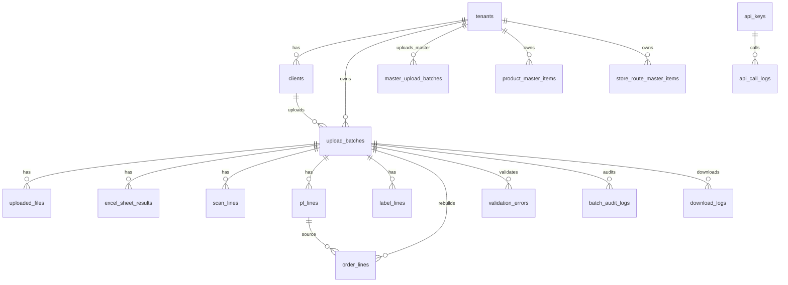

# OMS 개발 과정 발표자료

발표 대상: 개발팀, 기획팀, 물류 운영팀  
작성 기준일: 2026-05-29  
형식: Notion 정리 및 발표용 요약 Markdown

---

## 1. 발표 핵심

- 원본 주문 관리처럼 보이는 기능 제거
- Scan / PL / Label / 주문 요약의 역할 재정의
- 마스터 관리를 버전 선택이 아니라 현재 데이터 upsert 흐름으로 정리
- API 제공 현황과 라벨 다운로드를 별도 업무로 분리
- Error / Warning / Info 기준으로 배치 확정 가능 여부를 명확화

---

## 3. 데이터 구조를 먼저 잡은 이유

화면을 만들기 전에 `upload_batches`를 중심으로 데이터 관계를 먼저 정리했습니다.  
엑셀 파일 하나가 여러 목적의 시트로 나뉘고, 각 시트가 다시 조회·검증·외부 제공의 원천이 되기 때문입니다.

| 중심 테이블 | 역할 |
|---|---|
| `upload_batches` | 업로드 배치의 중심 |
| `excel_sheet_results` | 시트별 인식 결과 |
| `scan_lines` | Scan 원천 데이터 |
| `pl_lines` | PL 원천 데이터 |
| `label_lines` | Label 원천 데이터 |
| `order_lines` | PL 기반 주문 요약 |
| `product_master_items` | 현재 상품 마스터 |
| `store_route_master_items` | 현재 배송지/차량 마스터 |
| `validation_errors` | 검증 결과 |
| `batch_audit_logs`, `api_call_logs`, `download_logs` | 운영 추적 |

---

## 4. UX 수정 방향

초기 화면에는 개발자 입장에서 자연스러운 버튼과 표현이 많았습니다.  
하지만 OMS 요구사항 기준으로 보면 운영자에게 잘못된 업무 가능성을 암시하는 요소가 있었습니다.

| 초기 방향 | 수정 방향 |
|---|---|
| `신규 주문 등록` | 제거. OMS는 주문 생성 시스템이 아님 |
| `요약 정보 수정` | 제거. 원본 데이터 수정처럼 보이지 않게 함 |
| PL 화면의 `QR 일괄 인쇄` | 제거. PL 조회와 출력 업무를 혼동하지 않게 함 |
| 우하단 `+` 플로팅 버튼 | 제거. 신규 생성 액션처럼 보임 |
| 마스터 `버전 선택/활성화` | 제거. 현재 마스터 upsert 결과 중심으로 변경 |
| 검증 대기 상태의 확정 버튼 | 제거 또는 비활성. 검증 후에만 확정 가능 |
| 미확정 배치 다운로드/제공 가능 표현 | 제거. 확정 배치만 가능하게 표시 |

이 과정에서 화면은 더 단순해졌지만, 업무 정책은 오히려 더 명확해졌습니다.

---

## 5. 페이지 분리를 고민한 이유

처음에는 조회 화면을 크게 묶을 수도 있었지만, 실제 운영 흐름을 보면 화면을 분리하는 편이 더 안전했습니다.

| 화면 | 분리한 이유 |
|---|---|
| OIS 엑셀 업로드 | 파일 선택, 시트 인식, 검증 실행이 한 흐름 |
| 배치 목록 | 여러 업로드 건의 상태와 후속 작업을 빠르게 판단 |
| 배치 상세 | 특정 배치의 상태 전환과 시트별 결과 확인 |
| 검증 결과 | Error/Warning/Info를 행 단위로 확인 |
| 주문 조회 | 원본 주문이 아니라 PL 기반 요약 조회임을 분리 |
| Scan 조회 | `Scan_upload_*` 원천 데이터 확인 |
| PL 조회 | Picking List 원천 데이터 확인 |
| Label 조회 | Label 원천 데이터 확인 |
| API 제공 현황 | WOS/PL에 제공 가능한 확정 배치만 관제 |
| 라벨 다운로드 | API가 아니라 엑셀 다운로드 업무로 분리 |
| 상품 마스터 | 상품 기준정보 upsert |
| 배송지/차량 마스터 | 배송지, 차수, 차량 기준정보 upsert |
| 이력/로그 | 배치, API 호출, 다운로드 추적 |

특히 `API 제공 현황`과 `라벨 다운로드`는 같은 “외부 제공”처럼 보일 수 있지만, 실제 제공 방식이 다르기 때문에 화면을 나눴습니다.

---

## 6. 화면별로 바꾼 판단

### OIS 업로드

- 업로드 전, 파일 선택, 업로드 완료, 검증 대기 상태를 분리
- 업로드 직후에는 `배치 확정`이 아니라 `검증 실행`을 우선
- `Scan_upload_군량리` 같은 0건 시트는 오류가 아니라 정상 시트로 표시
- 현재 마스터가 없으면 검증 실행이 가능해 보이지 않게 처리

### 배치 상세

- 상태별 Primary Action을 하나로 정리
- Error가 있으면 확정 불가를 명확히 표시
- 확정 완료 후에는 `라벨 다운로드`, `API 제공 상태 보기`를 후속 액션으로 이동
- 롤백은 관리자성 위험 액션으로 분리

### 검증 결과

- Error를 기본 필터로 두고 운영자가 먼저 막힌 항목을 보게 구성
- 원본값, 정규화값, 마스터 매칭 결과를 한 화면에서 비교
- 직접 수정 화면처럼 보이지 않게 `원본 확인`, `관련 마스터 보기`, `재검증` 중심으로 정리

---

## 7. 마스터 화면에서 바꾼 판단

마스터 화면은 개발 과정에서 가장 크게 방향이 바뀐 영역입니다.

처음에는 `활성 버전`, `버전 선택`, `버전 활성화` 같은 표현이 자연스러워 보였습니다.  
하지만 실제 1차 MVP 기준은 업로드마다 버전을 선택하는 방식이 아니라, tenant별 현재 마스터에 파일 내용을 반영하는 방식이었습니다.

| 이전 표현 | 변경 후 표현 |
|---|---|
| 활성 버전 | 현재 마스터 |
| 버전 활성화 | 업로드 반영 |
| 적용 버전 | 검증 기준 시각 |
| 버전별 비교 | 마지막 업로드 결과 |
| 마스터 변경 이력 상세 | 파일 단위 업로드 이력 |

그래서 상품 마스터와 배송지/차량 마스터는 각각 별도 화면으로 유지하고, 화면의 중심을 `추가/수정/변경없음/실패` 결과로 바꿨습니다.

---

## 8. 운영자를 위한 표현 정리

개발 과정에서 버튼과 문구도 계속 조정했습니다.

| 상황 | 화면 표현 방향 |
|---|---|
| 업로드 완료 | 인식된 시트를 확인한 뒤 검증 실행 |
| 0건 Scan 시트 | 데이터 행이 0건인 정상 시트 |
| 검증 전 | 아직 확정할 수 없음 |
| Error 있음 | Error가 존재하여 확정 불가 |
| Warning 있음 | 운영 정책 확인 후 확정 가능 여부 판단 |
| 확정 완료 | 외부 API 제공 및 라벨 다운로드 대상 |
| 미확정 배치 | API 제공/다운로드 대상 아님 |
| 주문 조회 | PL 기반 OMS 주문 요약 조회 |

목표는 “시스템이 무엇을 할 수 있는지”보다 “운영자가 지금 무엇을 해야 하는지”를 먼저 보이게 하는 것이었습니다.

---

## 9. Backend는 화면 판단을 검증하는 방식으로 구현

Backend 구현은 화면에서 정리한 업무 규칙을 실제로 강제하는 방향으로 진행했습니다.

- 업로드 배치를 중심으로 데이터 저장
- `Scan_upload_*`, `PL_EA`, `PL_Box`, `Label_EA`, `Label_Box` 시트 인식
- PL 기반 `order_lines` 재구성
- 상품 마스터와 배송지/차량 마스터 직접 매칭
- Error가 있으면 배치 확정 차단
- 확정 배치만 외부 API와 라벨 다운로드 대상
- 배치 상태 변경, API 호출, 다운로드 이력 저장

즉, 화면에서 막아야 하는 정책을 Backend에서도 다시 막도록 구성했습니다.

---

## 10. 현재 데모에서 보여줄 포인트

발표 데모는 기능 목록보다 “업무 판단이 어떻게 이어지는지”를 보여주는 방식이 적합합니다.

1. OIS 엑셀 업로드
2. 시트 인식 결과 확인
3. `Scan_upload_*`와 0건 시트 정상 처리 확인
4. 현재 마스터 기준 검증 실행
5. Error / Warning 확인
6. Error가 없을 때만 배치 확정
7. 확정 후 조회, API 제공, 라벨 다운로드 가능 상태 확인

이 흐름은 “엑셀 파일을 올렸다”가 아니라, “운영 가능한 배치인지 판단하고 확정한다”는 관점으로 설명할 수 있습니다.

---
