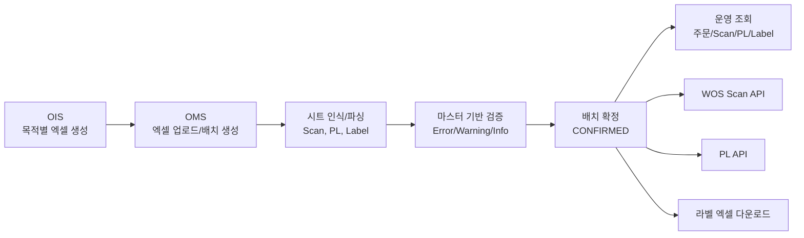
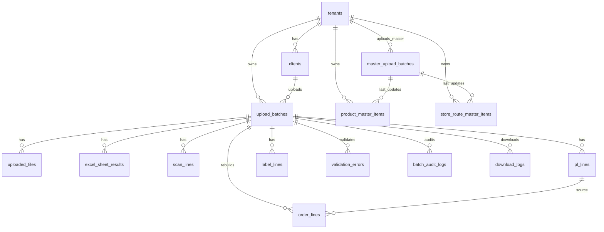

# OMS 프로젝트 현재 구현 현황

발표 대상: 개발팀, 기획팀, 물류 운영팀  
작성 기준일: 2026-05-28  
근거 문서: `AGENTS.md`, `README.md`, `docs/OMS_개발팀_전달용_최종요구사항_Codex_대화반영_최종.md`, `docs/IMPLEMENTATION_PLAN.md`, `docs/DB_DECISION.md`, `docs/DB_DESIGN_PROPOSAL.md`, `docs/ERD_DESIGN.md`, `docs/API_DESIGN_DRAFT.md`, `backend/`, `frontend/`

---

## 1. 프로젝트 개요

OMS는 OIS가 생성한 목적별 엑셀 데이터를 업로드 받아 저장, 검증, 조회, 외부 API 제공, 엑셀 다운로드를 수행하는 물류 운영 시스템입니다.

현재 저장소의 구현 단계는 **Backend Phase 2 기반 구조 + Frontend Phase 3 mock 화면 skeleton** 수준입니다.

| 구분 | 현재 상태 | 근거 |
|---|---|---|
| 요구사항 | 최종 요구사항 정리 완료 | `docs/OMS_개발팀_전달용_최종요구사항_Codex_대화반영_최종.md` |
| 구현 계획 | Phase 0~9 단계 정의 | `docs/IMPLEMENTATION_PLAN.md` |
| Backend | 공통 응답, requestId, 예외, 인증 skeleton, 감사 skeleton, 파일 저장 skeleton 구현 | `backend/src/main/kotlin/com/company/oms/` |
| Frontend | 운영 화면 route와 mock data 기반 화면 구현 | `frontend/src/routes/router.tsx`, `frontend/src/api/mock/data.ts` |
| DB | 설계 문서와 draft SQL 존재, 실제 migration 미적용 | `docs/db/migrations/draft/V1__initial_schema_mysql.sql`, `backend/src/main/resources/db/migration/.gitkeep` |

---

## 2. OMS가 해결하려는 문제

현재 업무에는 OIS가 생성한 엑셀을 목적별 시스템과 운영자가 활용할 수 있는 형태로 정리하는 과정이 필요합니다.

OMS가 담당할 문제는 다음과 같습니다.

| 문제 | OMS 목표 |
|---|---|
| OIS 엑셀의 여러 시트가 각각 다른 목적을 가짐 | 시트별로 의미를 인식하고 DB에 구조화 저장 |
| Scan, PL, Label 데이터가 분산됨 | 배치 단위로 묶어 조회, 검증, 추적 |
| 원본 주문 시트가 따로 없음 | PL 데이터를 기준으로 OMS 조회용 주문 요약 재구성 |
| 운영 오류가 엑셀 단계에서 늦게 발견됨 | 상품 마스터, 배송지/차량 마스터 기반 검증 |
| 외부 시스템 제공 기준이 불명확할 수 있음 | CONFIRMED 배치만 외부 API와 다운로드 대상으로 제한 |

중요 전제: OMS는 **원본 주문 생성 시스템이 아닙니다**. 원본 주문 시트도 현재 입력 엑셀에는 별도로 존재하지 않습니다.

---

## 3. OIS -> OMS -> 외부 시스템 구조

현재 실제 구현 상태는 아래와 같이 구분됩니다.

| 영역 | 상태 |
|---|---|
| OIS 엑셀 업로드/파싱/검증/확정 | 미구현 |
| 외부 WOS/PL API | 설계 완료, 미구현 |
| 라벨 다운로드 | 화면 skeleton/mock, Backend 미구현 |
| 운영 조회 화면 | Frontend mock 화면 구현 |
| 공통 API 응답과 requestId | Backend 실제 구현 |

---

## 4. 핵심 입력 시트

최종 요구사항의 핵심 입력 시트는 다음 5계열입니다.

| 입력 시트 | 의미 | 처리 원칙 | 현재 구현 상태 |
|---|---|---|---|
| `Scan_upload_*` | WOS/스캔 업로드용 바코드 단위 데이터 | prefix로 Scan 계열 인식, suffix는 `scanCenter` 후보로 저장 | 요구사항/DB 설계/mock 반영, 실제 파서 미구현 |
| `PL_EA` | EA 단위 Picking List | PL 데이터 저장, 주문 조회 재구성 원천 | 요구사항/DB 설계/mock 반영, 실제 파서 미구현 |
| `PL_Box` | BOX 단위 Picking List | PL 데이터 저장, 주문 조회 재구성 원천 | 요구사항/DB 설계/mock 반영, 실제 파서 미구현 |
| `Label_EA` | EA 라벨 출력 데이터 | 라벨 조회/다운로드 원천, 품목코드 예외 확인 필요 | 요구사항/DB 설계/mock 반영, 실제 파서 미구현 |
| `Label_Box` | BOX 라벨 출력 데이터 | 라벨 조회/다운로드 원천 | 요구사항/DB 설계/mock 반영, 실제 파서 미구현 |

특히 `Scan_upload_군량리`처럼 헤더만 있고 데이터가 0건인 시트는 정상 케이스입니다. 이 정책은 mock 데이터에 반영되어 있으나 실제 파싱 로직은 아직 없습니다.

---

## 5. 현재까지 구현된 Backend 범위

Backend는 Spring Boot Kotlin 기반 구조가 실제 코드로 준비되어 있습니다.

| 구분 | 실제 구현 | 근거 파일 |
|---|---|---|
| 애플리케이션 골격 | Spring Boot Kotlin, Java 21, JPA/Flyway/MySQL 의존성 준비 | `backend/build.gradle.kts`, `backend/src/main/kotlin/com/company/oms/OmsApplication.kt` |
| 공통 응답 | Controller 응답을 `success/data/error/meta` 형식으로 wrapping | `backend/src/main/kotlin/com/company/oms/common/response/` |
| requestId | `X-Request-Id` 수신/생성 및 응답 반영 | `backend/src/main/kotlin/com/company/oms/common/request/RequestIdFilter.kt` |
| 공통 예외 | 공통 예외 타입과 handler 구현 | `backend/src/main/kotlin/com/company/oms/common/error/` |
| 확인용 API | `/api/v1/health`, `/api/v1/system/ping`, `/api/v1/system/error-sample` | `backend/src/main/kotlin/com/company/oms/common/health/HealthController.kt`, `backend/src/main/kotlin/com/company/oms/common/system/SystemController.kt` |
| 인증 skeleton | Security 설정은 전체 permitAll, Token/AuthContext interface와 Noop 구현 | `backend/src/main/kotlin/com/company/oms/auth/` |
| 감사 skeleton | Audit event/service interface와 Noop logging 구현 | `backend/src/main/kotlin/com/company/oms/audit/` |
| 파일 저장 skeleton | 로컬 파일 저장, SHA-256 hash 계산 interface 구현 | `backend/src/main/kotlin/com/company/oms/upload/storage/` |
| 테스트 | 공통 응답, 예외, requestId, health endpoint 테스트 | `backend/src/test/kotlin/com/company/oms/OmsApplicationTests.kt` |

명확히 미구현인 Backend 기능: Multipart 업로드 API, Apache POI 엑셀 파서, DB Entity/Repository, 실제 Flyway migration, 배치 상태 전환, 마스터 업로드, 검증 엔진, 주문/Scan/PL/Label 조회 API, 외부 API, 다운로드 API.

---

## 6. 현재까지 구현된 Frontend 범위

Frontend는 React + TypeScript + Vite + Tailwind 기반의 운영 화면 skeleton이 mock data로 구현되어 있습니다.

| 구분 | 현재 상태 | 근거 파일 |
|---|---|---|
| 라우팅 | 주요 운영 route 구성 | `frontend/src/routes/router.tsx` |
| Layout | AppShell, Header, Sidebar, Breadcrumb 구성 | `frontend/src/components/layout/` |
| 공통 UI | Badge, Button, Card, Input, Select, Loading/Error/Empty 상태 | `frontend/src/components/common/` |
| 표 UI | 고정 헤더/가로 스크롤 기반 DataTable, FilterBar, Pagination | `frontend/src/components/data/` |
| 도메인 UI | BatchStatusBadge, SeverityBadge, FileUploadDropzone, ValidationErrorPanel 등 | `frontend/src/components/domain/` |
| 화면 | Dashboard, Uploads, Batches, Batch Detail, Validation, Orders, Scan, PL, Label, Downloads, Masters, Audit | `frontend/src/pages/` |
| 타입 | API/Batch/Order/Scan/PL/Label/Master/Validation/Audit 타입 정의 | `frontend/src/types/` |
| 데이터 | 실제 Backend 호출 대신 mock data 사용 | `frontend/src/api/mock/data.ts` |

`frontend/src/api/client.ts`와 `frontend/src/api/endpoints.ts`는 API client 구조만 준비된 상태입니다. 현재 화면은 실제 Backend API와 연결되어 있지 않습니다.

---

## 7. DB/ERD 설계 현황

DB는 아직 최종 확정하지 않았고, 1차 MVP 기본 후보는 MySQL로 검토 중입니다. PostgreSQL은 확장성 비교안으로 유지합니다.

| 구분 | 상태 | 근거 |
|---|---|---|
| DB 선택 | MySQL 1차 후보, PostgreSQL 비교안 | `docs/DB_DECISION.md` |
| ERD | tenant/client/batch 중심 ERD 설계 완료 | `docs/ERD_DESIGN.md` |
| 테이블 설계 | 핵심 테이블, 인덱스, 타입 정책 설계 완료 | `docs/DB_DESIGN_PROPOSAL.md` |
| SQL 초안 | MySQL initial schema draft 작성 | `docs/db/migrations/draft/V1__initial_schema_mysql.sql` |
| 실제 적용 | 아직 Backend Flyway migration에는 승격되지 않음 | `backend/src/main/resources/db/migration/.gitkeep` |

핵심 설계 원칙은 `upload_batches`를 중심으로 `scan_lines`, `pl_lines`, `label_lines`, `order_lines`를 연결하는 구조입니다. `order_lines`는 원본 주문이 아니라 `PL_EA`/`PL_Box` 기반의 OMS 조회용 요약 데이터입니다.

DB 설계는 운영 데이터 격리와 추적성을 우선합니다. 모든 업로드/운영 데이터는 `tenant_id + client_id + batch_id` 기준으로 조회할 수 있도록 설계되어 있으며, 원본 엑셀의 `sheet_name`, `row_no`, `raw_row_json`을 최대한 보존하는 방향입니다.

| 설계 영역 | 주요 테이블 | 설계 포인트 |
|---|---|---|
| 기준정보 | `tenants`, `clients`, `users`, `roles`, `api_keys` | 물류사와 고객사/화주사를 분리하고 API Key 접근 범위를 제한할 수 있습니다 |
| 업로드 | `upload_batches`, `uploaded_files`, `excel_sheet_results` | 파일, 배치, 시트별 처리 결과를 분리해 업로드 이력을 추적합니다 |
| 운영 데이터 | `scan_lines`, `pl_lines`, `label_lines`, `order_lines` | Scan/PL/Label 원천 행을 분리하고 PL 기반 주문 요약을 별도 생성합니다 |
| 마스터 | `master_upload_batches`, `product_master_items`, `store_route_master_items` | 마스터는 tenant별 현재 데이터를 upsert하고, 업로드 파일 단위 처리 요약을 남깁니다 |
| 검증/로그 | `validation_errors`, `batch_audit_logs`, `api_call_logs`, `download_logs` | 검증 결과, 배치 상태 변경, 외부 API 호출, 다운로드 이력을 남깁니다 |

ERD 관점의 중심 관계는 다음과 같습니다.

현재 ERD와 SQL draft는 리뷰 가능한 설계 산출물입니다. 다만 아직 `backend/src/main/resources/db/migration/`에 실제 Flyway migration으로 적용되지 않았고, JPA Entity/Repository도 구현되지 않았습니다.

---

## 8. 현재 데모 가능한 범위

현재 데모 범위는 실제 업무 처리 데모가 아니라 **기반 구조와 mock UI 데모**입니다.

| 데모 항목 | 가능 여부 | 설명 |
|---|---|---|
| Backend health 확인 | 가능 | `/api/v1/health` |
| Backend 공통 응답 확인 | 가능 | `/api/v1/system/ping` |
| Backend 공통 예외 확인 | 가능 | `/api/v1/system/error-sample` |
| Frontend 로그인 화면 | 가능 | dummy/skeleton 화면 |
| Dashboard | 가능 | mock 배치 기준 metric/table |
| 업로드 화면 | 부분 가능 | 파일 dropzone과 시트 결과 mock 표시, 실제 업로드 버튼 disabled |
| 배치/검증/주문/Scan/PL/Label 화면 | 가능 | mock table 표시 |
| 마스터/감사 화면 | 가능 | mock table 표시 |
| 실제 엑셀 업로드부터 확정까지 | 불가 | Backend 업무 API와 파서 미구현 |
| 실제 다운로드 파일 생성 | 불가 | Frontend skeleton, Backend 미구현 |

데모 성격은 실제 운영 처리 결과가 아니라 목표 사용자 흐름을 보여주는 목업 화면입니다.

---

## 9. 아직 구현하지 않은 기능

현재 미구현 범위는 다음과 같습니다.

| 영역 | 미구현 항목 |
|---|---|
| Upload | `/api/v1/order-excel-batches` Multipart 업로드 API, uploaded file metadata DB 저장 |
| Excel Parsing | Apache POI 기반 XLSM/XLSX 파싱, `Scan_upload_*` prefix 인식, 0건 시트 정상 처리 |
| DB | JPA Entity/Repository, 실제 Flyway migration, seed data, DB 통합 테스트 |
| Master | 상품 마스터 CSV 업로드/upsert/조회, 배송지/차량 마스터 XLSX 업로드/upsert/조회, 업로드 이력 요약 |
| Validation | 필수값/중복/마스터 매칭 검증, Error 확정 차단, Warning/Info 정책 적용 |
| Batch | 상태 전환, confirm/cancel/rollback, 감사 로그 DB 저장 |
| Query/API | 주문/Scan/PL/Label 실제 조회 API |
| External API | `/external/v1/wos/scan-upload`, `/external/v1/pl/picking-list` |
| Download | 라벨 엑셀 다운로드, 다운로드 로그 |
| Auth | 실제 로그인/JWT/API Key 인증/권한 |
| Frontend 연동 | mock data 제거, 실제 API 연동, 업로드/확정/다운로드 동작 |
| 차수별 기능 | 차수별 주문 조회/다운로드/대시보드. 1차 MVP 필수에서 제외, 추후 구현 |

---

## 10. 다음 개발 단계

`docs/IMPLEMENTATION_PLAN.md` 기준으로 다음 단계는 Phase 4부터 실제 업무 기능 구현에 진입합니다.

| 우선순위 | 다음 작업 | 산출물 |
|---|---|---|
| 1 | DB 결정 확인 및 draft SQL을 실제 migration으로 승격 | Flyway migration, Entity/Repository |
| 2 | OIS 엑셀 업로드 API 구현 | Multipart API, file metadata, batch 생성 |
| 3 | Excel sheet detector/parser 구현 | `Scan_upload_*`, `PL_EA`, `PL_Box`, `Label_EA`, `Label_Box` 파서 |
| 4 | 운영 데이터 저장 구현 | `scan_lines`, `pl_lines`, `label_lines`, `excel_sheet_results` |
| 5 | 마스터 업로드/upsert 구현 | product/store-route master API, master upload history API |
| 6 | 검증 엔진과 배치 확정 구현 | validation_errors, confirm/cancel/rollback |
| 7 | 조회/API/다운로드 구현 | 주문/Scan/PL/Label 조회, 외부 API, 라벨 다운로드 |
| 8 | Frontend 실제 API 연동 | mock 제거, 사용자 작업 흐름 연결 |

초기 개발의 핵심은 "엑셀 1개를 업로드하면 배치, 시트 결과, line 저장 결과가 조회되는 것"입니다.

---

## 11. 확인 필요한 의사결정

요구사항과 설계 문서에서 `확인 필요`로 남아 있는 결정은 다음과 같습니다.

| 의사결정 | 영향 |
|---|---|
| 회사 운영 MySQL 버전과 최종 DB 확정 | migration 문법, 제약조건, 테스트 DB 기준 |
| Flyway/Liquibase 등 migration 도구 표준 | schema 관리 방식 |
| 업로드 파일 보관 위치, 보관 기간, 최대 크기 | 파일 저장소 구현과 운영 정책 |
| JWT/Session 내부 인증 방식 | 로그인, 권한, 사용자 관리 |
| 외부 API Key 저장/만료/회전 정책 | WOS/PL API 보안 |
| 대표 배송일 기준 | Scan `deliveryDate`와 PL/Label `dueDate` 중 조회 기준 |
| `Label_EA` 품목코드 공란/소분상품 정책 | Error/Warning 분류와 확정 가능 여부 |
| 차량명 불일치, 차수/권역 불일치 등급 | 운영 차단 수준 |
| 화면 용어 | `scanCenter`, 센터, 거점, 노선, 버스 중 표시 명칭 |
| 라벨 다운로드 컬럼 순서와 포맷 | 다운로드 API와 운영 엑셀 결과물 |
| 외부 API 최신 배치 선택 정책 | `batchId` 미지정 시 응답 기준 |

---

## 12. 결론

현재 OMS 저장소는 요구사항, DB/API/ERD 설계, Backend 공통 기반, Frontend mock 운영 화면까지 준비된 상태입니다.

다만 현재 구현은 **실제 OMS 업무 처리 완료 상태가 아닙니다**. 실제 엑셀 업로드, 파싱, DB 저장, 검증, 배치 확정, 외부 API, 다운로드는 다음 구현 대상입니다.

현재 상태 요약은 다음과 같습니다.

| 구분 | 결론 |
|---|---|
| 완료 | 기준 문서 정리, Phase 계획, DB/API/ERD 초안, Backend 공통 기반, Frontend mock 화면 |
| 설계 완료 | 핵심 테이블, API 초안, 입력 시트 처리 원칙, 차수별 기능 제외 원칙 |
| 목업 | 운영 화면, 배치/검증/조회/마스터/감사 데이터 표시 |
| 미구현 | 실제 업무 API, Excel parsing, DB persistence, validation, external API, download |
| 다음 목표 | 실제 OIS 엑셀 1건을 업로드해 DB 저장 및 시트 결과 조회까지 연결 |
